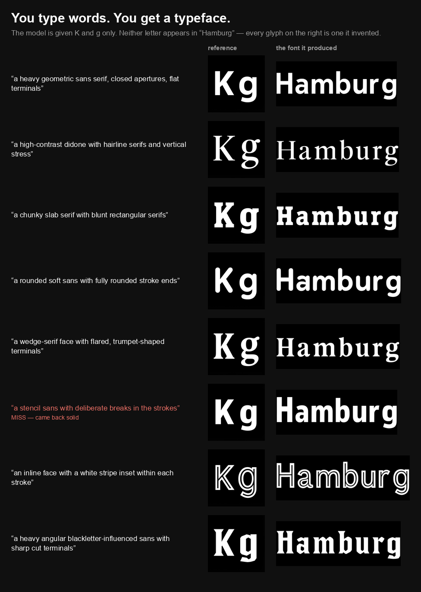
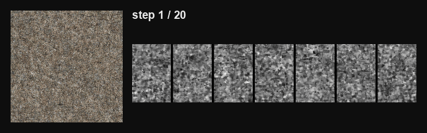
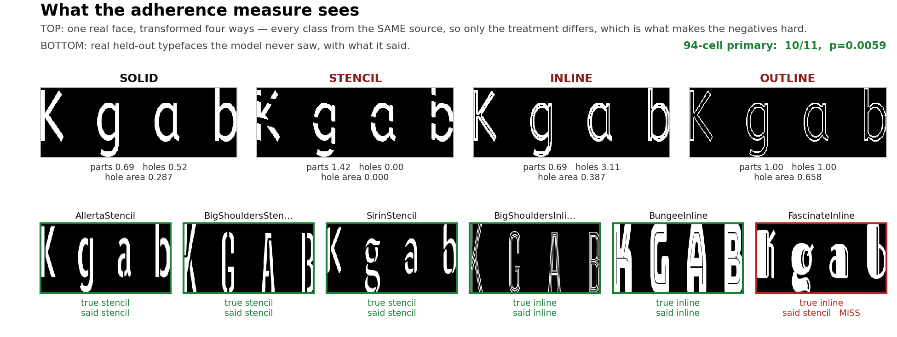
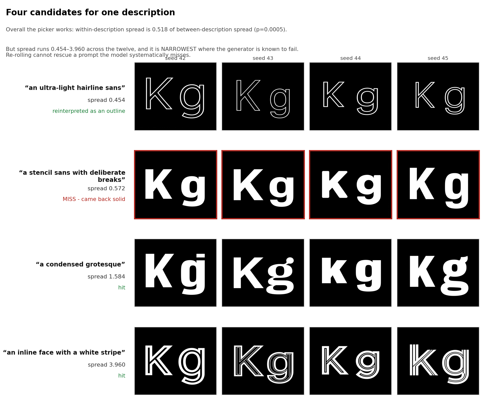
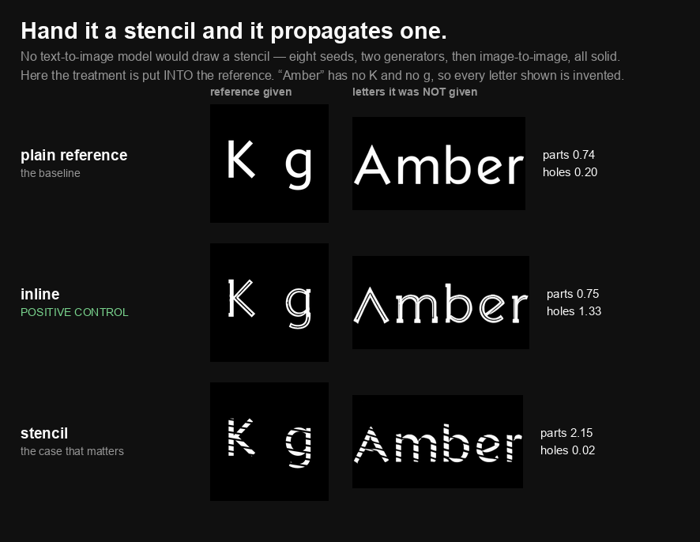
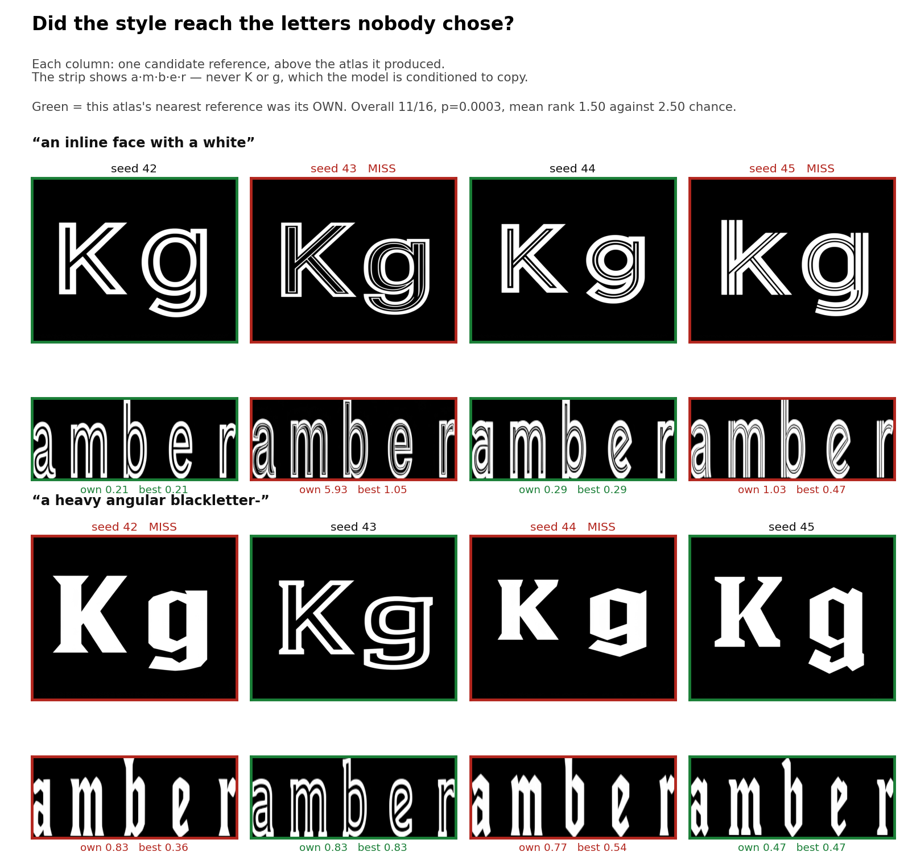

# digital-rain — Glyph-Conditioned Font Generation

[](https://github.com/sushiHex/digital-rain/actions/workflows/ci.yml)

**You describe a typeface in words. Ninety seconds later you have all 94 characters of it.**

A LoRA adapter on FLUX.2-klein with a custom glyph-latent conditioning channel, trained on one RTX 3090. Shown two glyphs of a typeface it has never seen, it draws the other 92 in the same style — serifs, stroke weight, cursive joins, distress texture, even dot-grid topology. Then the reference stopped having to come from a font at all: the two glyphs can be drawn from a sentence.



*Each row is one description, the `K` and `g` it produced in a single generation, and "Hamburg" set in the finished font. Neither letter appears in the word, so every glyph on the right is one the model invented. The stencil row is kept as the miss it was.*

**In five lines**

- **It works, and the mechanism was proved rather than assumed.** Zero the conditioning channel at fixed weights, reference, prompt and seed, and letter identity collapses from 0.56 to 0.04 while style similarity keeps 81% of its score: the reference carries style, the channel carries identity. ([ablation](#how-it-works))
- **Words in, typeface out, in about 90 seconds on two Apache-2.0 models.** Twelve descriptions, twelve references, twelve fonts, nothing hand-picked; 12 of 12 references cleared the coherence gate. ([note](research/2026-08-23-the-loop-closes.md))
- **The instruments were audited harder than the model.** A retrieval baseline beats every checkpoint on both style metrics; three training runs identical but for the seed land 0.12 apart on the headline metric; scored against each metric's own noise, the six effects that survive are all regressions. Every retraction stays in the record. ([the audit](#the-most-interesting-result-isnt-the-model))
- **Three instruments for a product with no ground truth:** coherence, validated twice at n=50; identity, 0.99 on gated cells; adherence, 10 of 11 held-out typefaces — it ranks, it does not yet calibrate. ([instruments](#the-product-loop-and-the-axis-with-no-instrument))
- **Reproducible from a clean clone, no weights, no GPU.** The results table regenerates with one command, and CI runs the suite on every commit. ([setup](#setup))

**Where to read next.** The six-month account, in six acts: [`docs/what-happened.md`](docs/what-happened.md). The dated notes, never rewritten when a later one overturns them: [`research/`](research/README.md). The illustrated architecture write-up: [faiman.com/writing/generative-eval](https://faiman.com/writing/generative-eval.html). What is held back for a possible service, and why: [`docs/public-release.md`](docs/public-release.md). The model track is closed on the arithmetic below; the live work is the product loop and its third instrument ([open threads](#to-be-continued)). No weights are published ([licensing](#licensing-hard-constraints)).


*Ten typefaces whose files were held out of training — 32 of the 50 share a superfamily with a training font, so this is a file holdout, not out-of-distribution generalisation. "Hamburg" is composed from generated cells with naive spacing, not kerned ([limitations](#limitations)).*

---

## The most interesting result isn't the model

**This project measured its own instruments and most of its published findings did not survive.** That record — not the font generator — is what is worth reading here.

Three measurements, each of which invalidated work that preceded it:

**1. A trivial baseline beats every model.** Take a holdout font's reference image, find the nearest font in the *training corpus* by DINOv2, and hand back that font's ground-truth atlas. No model, no GPU:

| | retrieval | best model (9B) | 4B |
|---|---|---|---|
| char_acc | **0.7768** | 0.6917 | 0.6183 |
| DINOv2 | **0.9389** | 0.8788 | 0.8388 |

Returning *a different real typeface* scores higher than generating the right one. So these two metrics measure general font-likeness, not generation — and every model comparison in this repo was built on them. ([note](research/2026-08-13-a-retrieval-baseline-beats-every-model.md))


*Same word, three sources. Row 3 is a **different real typeface** — and on Dangrek and IBMPlex it is hard to tell from the other two. That is precisely why it wins: nearest-neighbour retrieval returns something genuinely similar, and the metric cannot distinguish that from an attempt at the right font. Regenerate with `python viz/retrieval_vs_model.py`.*

> **Scope, added 2026-08-21.** This holds for the benchmark as built, where the target is a real held-out typeface. The intended product is different: the user describes a style, a generative model draws the two reference characters, and the user selects and iterates — so there is **no target font**, and "hand back the nearest training font" stops being a near-miss and becomes the wrong answer. That reframing is the one thing that makes the benchmark problem tractable. It has been probed, not solved: [Two styles in, two styles out](research/2026-08-21-two-styles-in-two-styles-out.md).

**2. Training-run variance was never measured, and it is larger than every effect ever chased.** Three runs identical except `--seed` gave char_acc means of **0.4914 / 0.6070 / 0.5869**. The comparison tool — used for every A/B here — declares two of those three *identical-config* pairs a significant char_acc improvement (`r=0.74`, `r=0.66`), and on DINOv2 it fires on **all three**. For scale, the flagship result below is `r=0.768`. ([note](research/2026-08-13-training-run-variance-measured-at-last.md))

**3. Scored on every metric rather than one each, six effects do clear 2 SE — and every one of them is a regression.** The resolvable ones all live on LPIPS and composite, the metrics nobody was watching, which are 8–20× more stable than the two that were. Stacking two "improvements" is the largest real effect in the project, at **−13.5 SE**, and it is a regression. ([ledger](research/2026-08-13-the-claim-ledger-corrected.md))


*Top: three runs whose configs differ only in `--seed`. Bottom: every claim ÷ that metric's own run-to-run SD, columns ordered by that SD. Ringed cells clear 2 SE — all six are regressions, and all six sit in the two left-hand columns. The two on the right, char_acc and DINOv2, are the metrics every headline in this project was quoted against. Regenerate with `python viz/variance_vs_effects.py`.*

**8 of the 50 holdout ground-truth atlases are byte-identical to training atlases** — exact answer leakage, found only when something finally hashed the two sets against each other. ([note](research/2026-08-13-a-retrieval-baseline-beats-every-model.md))

None of this was found by a failing test. It was found by measuring things the project had assumed.

---

### The original finding, which still stands

**The standard metric for this task measures the wrong thing, and there's evidence.**

Font-generation work is typically scored with a DINOv2 template match ("char_acc"): does the generated cell look like the ground-truth glyph? That number sat at **0.688** here and refused to move — which reads as "the model gets ~31% of characters wrong."

It doesn't — but the reason is not the one this README gave for months, and the correction is worth more than the original claim.

**What `char_acc` actually computes** (`eval_checkpoint.compute_char_acc`): within one font, build a 94×94 cosine-similarity matrix between the generated cells and that font's own GT cells; cell *i* matches if `argmax_j sim(gen[i], gt[j]) == i`. It is a **within-font nearest-neighbour discrimination** — is this cell closer to its own GT rendering than to any *other glyph of the same font*.

That is not "style fidelity", which is how this README labelled it. The function's own docstring says the opposite: *"within a single font, all 94 cells share the same style, so cosine similarity within a font is dominated by glyph identity."* Style is largely **controlled for** by construction. What char_acc measures is closer to *shape discriminability against same-font alternatives* — sensitive to both identity and rendering, validated as neither.

So the honest framing is narrower: **char_acc is not exact letter correctness**, and a separate instrument is needed to measure that. It is not established that the residual is "style".

I built a font-invariant single-glyph classifier (94-class CNN, `glyph_classifier.py`, val_acc 0.9385 on 60 held-out fonts) to measure identity directly:

| definition, same 4,400 GT-gated cells | value |
|---|---|
| char_acc (within-font nearest-neighbour, *not* validated as style) | 0.692 |
| **exact 94-class identity** | **0.9355** |
| case-insensitive | 0.9889 |
| case-insensitive + isolated-glyph equivalences (**the reported IDENTITY**) | **0.9936** |
| *exact 94-class, all 4,700 cells, no gate* | *0.9243* |

**An earlier version of this section said "the model produces the correct letter 99.4% of the time." That was wrong**, and the correction matters more than the original claim. 0.9936 is a *lenient recognizability* score, not 94-class identity. It folds case, and `identity_score.EQUIV` merges `0/o/O`, `1/l/L/i/I/|`, `5/s/S`, `2/z/Z`, `8/b/B`, `9/g/G`, `u/U/v/V` — defensible for **isolated** glyphs with no word context, where `O` versus `0` genuinely is undecidable, but not the same statement. It is also computed on a GT-gated subset that drops the 300 hardest cells (char_acc 0.40 there against 0.71 on the cells kept), so the gate itself lifts the number.

The load-bearing point survives intact and is unaffected by which definition you pick: **identity is ~0.92–0.99 while char_acc is 0.69**, so char_acc is not measuring letter correctness. Verify any row above with `python analysis/verify_identity_definitions.py`.

Verified three independent ways:

1. **Wrong-letter audit** — 151 cells were judged genuinely wrong. This was reported as "3.2%", dividing by all 4,700 cells; but the procedure **abstains on ~2,500 cells** it cannot read, so 151 is **~6.9% of the cells actually scored**. Dividing by the full 4,700 silently counts every abstention as correct, and the abstentions are the hard ones. The further "~1% in scope" figure is not reproducible — mechanically excluding the Bitcount and Rubik fonts gives ~2.5%.
2. **Seed variance** — same-model best-of-4 reaches char_acc **0.8366**. The "+0.148" subtracted a *separately conditioned* seed-42 run from a mis-conditioned candidate pool; the correct within-pool figure is **+0.1628** against the pool's own best seed. The companion "88.6% already identity-correct at seed 0" comes from a script that labels itself GT-gated but never loads GT — it is a lenient-recognizability statistic on mis-conditioned candidates.
3. **A real bug the standard metric couldn't see** — below. This one holds up: under *exact* identity it is 0.9164 → 0.9355, 42 fonts better, none worse.

**Items 1 and 2 were overstated and are corrected here rather than deleted**, because the direction still holds — char_acc's residual is not mostly wrong letters — but the specific figures were wrong, and the conclusion they were used to justify (closing the DPO track) rested on them.

**Consequence:** this closed two expensive directions — a hardened-structure retrain, and a GT-guided preference pipeline. To be precise about the second: the three negative runs were **SFT self-distillation** (Stage A). The diffusion-DPO run (Stage B) was **built and then never executed** — `research/2026-06-03-generator-track-decision.md` says "do not pursue Stage B". So DPO is *untested*, not *tested and failed*. Writeup: [`research/2026-07-18-wrong-letters-are-a-metric-artifact.md`](research/2026-07-18-wrong-letters-are-a-metric-artifact.md).

### The instrument caught a defect the standard metric was blind to

Two models here were trained by different scripts with different text prompts, but evaluated with the same one — so the glyph model was scored on text conditioning it had never seen.

| metric | effect of fixing it | paired Wilcoxon (n=50) |
|---|---|---|
| char_acc | +0.0034 | **p=0.948 — invisible** |
| **IDENTITY** | **+0.0157** | **p<1e-6, r=0.870 — all 50 fonts better, zero worse** |

A project tracking only char_acc would never have found it. Details, and the guard that now prevents recurrence: [`research/2026-07-28-reference-char-mismatch.md`](research/2026-07-28-reference-char-mismatch.md), `conditioning_config.py`.

---

## Results

50-font holdout (4,700 cells), each model evaluated on the prompt it was actually trained with, paired Wilcoxon per font. Gate: **p<0.05 ∧ r≥0.3**.

| metric | baseline LoRA | **glyph-conditioned** | Δ | p | r | |
|---|---|---|---|---|---|---|
| char_acc (within-font NN, not validated as style) | 0.6677 | **0.6917** | +0.0240 | 0.0156 | 0.353 | ✅ |
| DINOv2 similarity | 0.8487 | **0.8788** | +0.0301 | <1e-5 | 0.768 | ✅ |
| LPIPS (lower better) | 0.1514 | **0.1457** | −0.0057 | 0.372 | 0.126 | ns |
| R-ACC (OCR **consistency**, not correctness — see below) | **0.7411** | 0.7279 | −0.0132 | 0.0066 | 0.424 | baseline ✅ |
| IDENTITY | **0.9968** | 0.9936 | −0.0032 | 0.0020 | 0.886 | baseline ✅ |

**Honest reading, corrected:** the "clean split" story does not survive scrutiny. char_acc and DINOv2 are **not two axes** — they share the same DINOv2 encoder and correlate 0.93/0.74 per font across these runs, so they are one evidence family. R-ACC is OCR *consistency* (`OCR(GT) == OCR(gen)`), not correctness: **30.7% and 31.9% of its "successes" are the OCR reading the same wrong string on both images** (verified). And the IDENTITY column is the lenient definition; under exact 94-class identity the baseline's edge is 0.9386 vs 0.9355 and is not significant. Every row is also single-seed — see the seed caveat below. Style fidelity is what glyph conditioning was designed for, and it wins there decisively. The identity edge is *statistically real but practically negligible*: 18 cells out of 4,400, both models above 99.3%. R-ACC is the more substantial of the two baseline wins (medium effect, r=0.424) and is not explained away by the identity result — a 0.3pp identity gap cannot account for a 1.3pp R-ACC gap, so some of it is legibility under OCR rather than letter correctness. Significance and practical importance diverge here, and both belong in the summary.

**The holdout is 46 independent fonts, not 50.** Hashing the committed artifacts (`analysis/check_holdout_integrity.py`): IBMPlexSansArabic/Thai/ThaiLooped and TiroGurmukhi/Tamil/Telugu are byte-identical atlases — non-Latin families sharing their Latin glyphs — so those typefaces carry triple weight and the paired n=50 is inflated. Separately, `BitcountGridDoubleInk` and `BitcountPropDoubleInk` share an identical *reference image* but have different ground truth, so the model emits identical output graded against two different answers; any per-font comparison between them measures the target, not the model.

The per-cell eval artifacts behind this table are committed, so it reproduces from a clean clone — see [Setup](#setup) for the command. (Run A is the base model; its directory is named for the prompt style it was evaluated with, not for a checkpoint.)

**Style diversity looks preserved on a small probe** — inter-font DINOv2 spread ratio **0.87** against ground truth (1.0 = perfectly preserved). Scope this correctly: it is computed over **7 hand-picked distinctive fonts** (`audit_diversity.DISTINCTIVE`), not the 50-font holdout, with no CI or seed replication. It supports "these seven did not collapse", not a general claim.

---

## The Apache-2.0 port, and where its remaining gap actually lives

The 9B base is non-commercial, so the whole architecture was re-trained on **`FLUX.2-klein-base-4B`** (Apache-2.0, `in_channels=128` on both, so the template cache ports unchanged). Same holdout, same protocol.

| metric | 4B (rank 32) | 9B | paired Wilcoxon, n=50 |
|---|---|---|---|
| composite | **0.8158** | 0.8137 | no diff (p=0.57) |
| R-ACC | 0.7360 | 0.7279 | no diff |
| LPIPS | 0.1381 | 0.1457 | no diff |
| IDENTITY | 0.9893 | 0.9936 | no diff (p=0.13) |
| char_acc | 0.6460 | **0.6917** | 9B better (r=0.563) |
| DINOv2 | 0.8485 | **0.8788** | 9B better (r=0.556) |

> **Those single-seed numbers UNDERSTATE the gap. Superseded 2026-08-08.** The table above is one seed per model, which cannot resolve a model difference: 91% of a run's holdout-mean variance is a seed main effect that does *not* average out across fonts (SD 0.0248, `analysis/seed_variance.py`), putting a single-seed A/B at SE ≈ 0.037. The matched **six-seed-per-model** run has since landed, and seed 42 turned out to be lucky for the 4B (0.6460 against a 0.6116 six-seed mean) — so the old comparison used the 4B's best face:
>
> | metric | 9B − 4B (6v6 seeds) | 95% CI | single-seed said |
> |---|---|---|---|
> | char_acc | **+0.0731** | [+0.0473, +0.0993] | +0.0457 |
> | DINOv2 | **+0.0440** | [+0.0325, +0.0555] | +0.0303 |
> | LPIPS | −0.0007 | [−0.0175, +0.0166] | no diff |
>
> n=44 unique fonts, CI resampling fonts *and* seeds, analysis pre-registered before the 9B arm finished. **The gap is real and ~60% larger than it looked.** The composite, R-ACC and IDENTITY rows were not re-scored at six seeds and remain single-seed. [`research/2026-08-08-multiseed-the-4b-9b-gap-is-real-and-bigger.md`](research/2026-08-08-multiseed-the-4b-9b-gap-is-real-and-bigger.md)

**Four of six metrics show no difference.** The deficit is confined to the two style axes.

Whether it is *also* confined to the hardest fonts is **unresolved**, and the correction is worth stating because the earlier answer here was wrong. Splitting the holdout by baseline difficulty appeared to show the 9B's whole advantage sitting in the harder half — but conditioning a delta on its own baseline is biased by construction, `Cov(a, b−a) = Cov(a,b) − Var(a)`, so seed noise alone drives that pattern. Measured on 12 pairs of *different seeds of the same model*, where the true effect is exactly zero, the old statistic returned rho **−0.253** and a spurious hard-vs-easy gap of **0.038**.

Re-derived against the midpoint (unbiased, rho −0.000 on that same null):

| 9B's advantage | harder 25 | easier 25 | gap | vs noise floor |
|---|---|---|---|---|
| char_acc | +0.0643 | +0.0272 | +0.0370 | **1.0x** |
| DINOv2 | +0.0502 | +0.0105 | +0.0397 | **1.0x** |

The gap is real in sign but sits *at* the noise floor, so "the 4B is only behind on distinctive fonts" is **not established**. The same correction deflates the five-lever redistribution pattern below — several of those levers fall under 1x. `analysis/compare_runs.py` now conditions on the midpoint and prints the `xnull` ratio so this cannot be over-read again.

**And at six seeds the sign inverts.** Against a frozen, model-independent moderator (holdout ground-truth atlases scored against the training-corpus centroid, so nothing is conditioned on the outcome), the 9B's char_acc advantage *shrinks* as fonts get more distinctive: Spearman **ρ = −0.536** (p=1.8e-4, n=44). The 4B's deficit is largest on **ordinary** typefaces — the worse half of the distribution to lose on, since workhorse text faces are a wider market than display faces. Quote the rank statistic, not the slope; they disagree (−0.193, SE 0.127, p=0.135), so the relationship is monotone but not linear.

The **levers** below are still measured from single-seed runs, and seed 42 is demonstrably lucky for the 4B. Only the 4B-vs-9B target has been re-measured at six seeds.

One more limit on what this table can claim: both checkpoints are **single training-seed-42 instances**, so replicating *inference* seeds establishes a difference between these two checkpoints, not between the 4B and 9B architectures. That would need independent training runs.

---

## How it works

**Problem.** Reference-image conditioning transfers *style* but not *letterform identity*. Failures were diffuse across the charset (33 characters accounted for 50% of errors) — an architectural limit, not a data one.

**Approach — glyph-latent channel concatenation.** A neutral template atlas (all 94 letterforms in a reference font) is VAE-encoded and concatenated along the **channel** axis with the noisy atlas latents:

```
atlas latents (6400, 128) ⊕ template latents (6400, 128) → (6400, 256)
x_embedder: Linear(128 → 4096)  ⟶  Linear(256 → 4096)   [new channels init 0]
```

The constraint that shaped the design: the obvious approach — appending template *tokens* — doubled sequence length to 13,824 and projected to ~9 days of training on one RTX 3090. Channel-concat holds the sequence at 7,424, so training cost is essentially unchanged (~4.4h for 5,000 steps). The widened `x_embedder` trains via PEFT `modules_to_save`.

**The mechanism was verified, not assumed.** Zeroing the template channel at inference — identical weights, reference, prompt and seed, template content replaced with zeros — collapses the model:

| 4B de-risk ablation | with template | zeroed | retains |
|---|---|---|---|
| **IDENTITY** — is it the right letter | **0.5609** | 0.0406 | **7.2%** |
| char_acc | 0.3050 | 0.0284 | 9.3% |
| R-ACC | 0.4149 | 0.0638 | 15.4% |
| DINOv2 — style similarity | 0.7295 | 0.5887 | **80.7%** |

The split is the result. **Style survives the ablation; letterform identity does not.** DINOv2 keeps 81% of its score with the template gone, while identity keeps 7% — the model still paints something in roughly the right style, and it is no longer the right character. That is the division of labour the architecture was designed around: the reference image was already carrying style, and the template channel is what carries identity. This is a 3-font, 400-step de-risk run, so read the ratios rather than the absolute values. ([note](research/2026-07-30-klein-4b-derisk-gate.md))

**Template disambiguation.** Confusable pairs (`\` vs `/`, `'` vs `"`, `O` vs `0`) render near-identically in a neutral template and the model over-trusted it. Mild distinguishing cues — slashed zero, serifed capital I, stroke-thickness asymmetry — recovered `\` from 0.06 → 0.34, applied **zero-shot to the existing checkpoint** with no retraining.

**Stack:** FLUX.2-klein-9B (quanto `qint8` for training, `qfloat8` at inference — see Limitations) · rank-32 LoRA · 24GB RTX 3090 · gradient checkpointing · 925-font training corpus · 50-font disjoint holdout.

---

## Repository

The repository root holds the core modules — everything the tests and the product entry points depend on. One-off scripts live in topical packages, each with a generated index of its contents.

| path | what |
|---|---|
| `train_lora_kg.py` | glyph-conditioned LoRA training (channel-concat) |
| `eval_checkpoint.py` | eval harness — LPIPS / R-ACC / DINOv2 / char_acc / IDENTITY, bootstrap CIs |
| `glyph_classifier.py` | font-invariant glyph classifier (the identity instrument) |
| `conditioning_config.py` | train/eval conditioning guard |
| `generation_lib.py` | pipeline + LoRA loader, single-atlas generation |
| `audit_diversity.py` | style-collapse audit |
| `atlas_to_font.py` | atlas → OTF via Potrace |
| `build_dataset.py` · `cache_latents.py` | corpus construction and latent caching |
| | |
| [`analysis/`](analysis/README.md) | post-hoc analysis of eval runs and checkpoints; the instruments live here |
| [`probes/`](probes/README.md) | small targeted spikes |
| [`studies/`](studies/README.md) | research probes and experiment drivers |
| [`pipeline/`](pipeline/README.md) | dataset construction, rendering, orchestration |
| [`cleanup/`](cleanup/README.md) | atlas cell repair and selection |
| [`misc/`](misc/README.md) | repository tooling, including the public exporter |
| [`viz/`](viz/README.md) | figure generators for the images above |
| [`benchmarks/`](benchmarks/README.md) | latency and throughput measurement |
| [`route_b/`](route_b/README.md) | Nunchaku INT4 runtime-LoRA track — closed, kept as the record |
| [`runners/`](runners/README.md) | the detached-run shell runners and their watchdogs, grouped by track |
| [`research/`](research/README.md) | the dated findings, negative results included, **indexed by theme** |
| `docs/` | the narrative ([`what-happened.md`](docs/what-happened.md)), protocols, roadmaps, [licensing](docs/licensing.md), and [how this repository is published](docs/public-release.md) |

Scripts in the packages run from the repo root either way — `python analysis/foo.py` or `python -m analysis.foo`. Counts are deliberately absent from this table: each package README's `Contents (N)` heading is **generated** from module docstrings by `misc/sync_package_readmes.py` and pinned by [`tests/test_package_readmes_current.py`](tests/test_package_readmes_current.py), because when the lists were hand-maintained `analysis/README.md` advertised 16 modules against a directory of 40, and a hand-typed count in this file drifted the same way.

---

## Setup

Python 3.12+. Training and evaluation need a CUDA GPU; this was developed on a single RTX 3090 (24 GB), where grad checkpointing is mandatory. Install torch from the CUDA index **first** — the plain PyPI wheels are CPU-only:

```bash
pip install torch torchvision --index-url https://download.pytorch.org/whl/cu128
pip install -r requirements.txt
pip install -e ".[dev]"        # pytest + ruff; or, as CI does: pip install pytest gradio
```

Optional extras, by track: `demo` (the Gradio app), `sft`, `vecglypher`. Route B additionally needs [`nunchaku`](https://github.com/nunchaku-tech/nunchaku), which is not on PyPI.

```bash
python -m pytest                                    # no GPU needed; tests that want the corpus, weights or potrace skip

# reproduce the results table above from the eval artifacts in this repo
# (it also writes a dated record of the comparison into research/)
python analysis/compare_runs.py \
    eval_runs/structured_prompt_5000/per_cell.json \
    eval_runs/prompt_trained_short/per_cell.json \
    --label-a baseline --label-b glyph

# score a checkpoint of your own
python eval_checkpoint.py --checkpoint <ckpt> --holdout eval_holdout \
    --out eval_runs/<name> --use-template --in-process \
    --prompt-style trained-short --identity --strict-conditioning
```

### Demo

`app.py` is a Gradio front end over the same path the eval harness validates: reference image → 95-character atlas → Potrace → OTF/WOFF2. **It is held in the private archive** — the product's code (the demo, the description-to-reference generator, the constructed-reference builder and the picker) is the part kept back for a possible service, while everything it was built on, and everything measured about it, is here. The description below is what it does.

```bash
python app.py                                          # Apache-2.0 4B, rank 64
python app.py --checkpoint training_glyph_r32_5000/final \
              --model black-forest-labs/FLUX.2-klein-base-9B
```

Override with `FONTGEN_CHECKPOINT` / `FONTGEN_MODEL`.

**The demo gates its input.** Before loading the transformer, `app.py` scores the two supplied reference glyphs for mutual style agreement and refuses a pair that disagrees, because the model copies whatever style it is given and would otherwise spend a minute producing a font that changes style part-way through a word. The rejection names the feature that differs — weight, slant, fill, or topology — so it reads as a re-roll instruction rather than a refusal. The threshold is **provisional** (calibrated on the spread of coherent references, not on references a person judged unacceptable), so the guard **fails open**: anything it cannot score is generated normally, and the check can be unticked. ([gate](research/2026-08-21-the-reference-gate.md))

**The rank-64 default is not evidence-backed, and saying so is the point of this README.** Rank 64 costs +1% training time and no extra memory, and there is no measured reason to prefer it: it showed **no difference on any metric** at the headline gate (composite p=0.53, char_acc p=0.96), and the "rank 64 is the lever" claim that motivated it was [retracted](research/2026-08-05-stacking-levers-overshoots-rank64-is-the-lever.md) once the statistic behind it was shown biased. It is the shipped default because it was the default when the work stopped. Do not read it as a recommendation.

This repository carries no Hugging Face Spaces configuration. The README front-matter that used to sit above the title was removed on 2026-08-18 — no Space is deployed, and hosting one is blocked by the [licensing constraints](#licensing-hard-constraints), not by the config.

**The demo defaults to the Apache-2.0 4B (rank 64), deliberately** — the 9B's FLUX Non-Commercial Licence makes a hosted demo a licensing problem, and the 4B is fast enough to be usable. **It is, however, a real quality compromise** — corrected 2026-08-08. The matched six-seed run resolves the 9B ahead by +0.0731 char_acc and +0.0440 DINOv2, both excluding zero, and the deficit falls hardest on *ordinary* typefaces. The earlier "no significant difference on composite, R-ACC, LPIPS or IDENTITY" was single-seed, and of those four only LPIPS has been re-tested at six seeds (it still ties). The 4B ships because of the Apache-2.0 licence and the 4-step speed win — not because it matches the 9B.

Trained weights are **not** in this repository (`training_*/` is gitignored), so the checkpoint must be supplied — via `--checkpoint` or `FONTGEN_CHECKPOINT`. The app derives `prompt_style`, `use_template` *and the base model* from the checkpoint rather than hardcoding them: a train/eval conditioning mismatch is silent and costly (see above), and crossing the 4B and 9B raises a shape error (hidden dim 3072 vs 4096), while a *same-size* base mismatch would be silent. The UI reports whichever base and rank it actually loaded, with its licence. On a 3090 the first run spends a few minutes loading and quantizing the transformer; generation is then ~2 min at 20 steps on the 4B, and vectorizing all 94 glyphs takes ~4 s.

---

## The product loop, and the axis with no instrument

Everything above evaluates against a **target font**, and on that framing a trivial retrieval baseline wins. The product has no target font: a user describes a style, a model draws the two reference glyphs, and a similar real typeface is not a near-miss but the wrong answer. That reframing is what makes the work above stop being the point — and it needs instruments that do not use ground truth, because there is none.

The chain runs, on two Apache-2.0 models already on disk:

```
"a rounded soft sans with fully rounded stroke ends"
  → FLUX.2-klein-base-4B, 25 s   → two-glyph reference (Kg), both letters in ONE call
  → analysis/reference_gate.py   → 0.811, well inside the 1.875 threshold
  → glyph-conditioned LoRA, 62 s → 94-glyph atlas
  → glyph_classifier.py          → identity 0.9043 — a usable font
```

*Those two numbers are that one font's, not the arm's. The twelve-font means are 0.958 and 0.9379 — the first write-up of this chain quoted the means inside a single-font trace, which is [corrected here](research/2026-08-23-the-loop-closes.md).*


*Words in, typeface out. Each row is one description, the `Kg` it produced in **one** generation — which is why both letters agree — and a word set in the finished font. **`K` and `g` are the only glyphs the model was given, and neither appears in "Hamburg"**, so every letterform on the right is one it invented. The stencil row is marked as a miss rather than dropped. Regenerate with `python viz/description_to_font.py`.*

Twelve descriptions, twelve references, twelve atlases, nothing hand-picked. **12 of 12 references cleared the gate**, 100% of their glyphs read as the right character (against 98% for real font renderings), and the *worst* invented reference (1.331) beat the *worst* real one (2.036). Downstream, atlases built from invented references scored **above** the 50-font oracle arm on every ground-truth-free metric — identity 0.9379 vs 0.9081, coherence 0.3137 vs 0.3368.

**That comparison is confounded, and the confound matters more than the numbers.** The oracle arm's 50 fonts contain the genuinely hard cases — dot-grid Bitcount, heavy distress, cursive Playwrite — while all twelve invented styles came back as conventional letterforms. **The generated set is easier, and both instruments reward that.** What the run does establish is the thing that was actually at risk: a reference *not rendered from a font file* is a distribution shift rather than a degradation, and it does not break the generator. ([the loop closes](research/2026-08-23-the-loop-closes.md); the round-1 candidate evaluation note is held privately)

Each finished row above is **internally consistent** — no splitting along the K-like / g-like seam that an inconsistent reference produces — and the unusual styles survive the full chain.



*One run, twenty steps, one frame each — the whole 94-glyph atlas emerging from noise, beside a word composed from its cells. These are the **intermediate latents of a single run**, not the results of separate 1-, 2-, 3-step runs: a shorter run follows a different schedule and is a different trajectory. The letters arrive late, around step 10–15, which is what a flow-matching schedule looks like. The decode is **verified, not trusted** — `viz/generation_progression.py` decodes the final latent with its own code and refuses to write the GIF unless it matches the image the pipeline returned (it matches at mean |diff| = 0.000).*

### Three axes, two instruments

| axis | the question | instrument | state |
|---|---|---|---|
| **coherence** | is this **one** typeface? | [`reference_gate.py`](analysis/reference_gate.py), [`style_coherence.py`](analysis/style_coherence.py) | **validated** — separates at r=0.678, predicts the atlas at ρ=+0.666 |
| **identity** | are these the right **letters**? | [`glyph_classifier.py`](glyph_classifier.py) | **validated**, font-invariant, pre-existing |
| **adherence** | is it the typeface you **asked for**? | [`synthesize_rare_attributes.py`](analysis/synthesize_rare_attributes.py) | **partial** — 4 treatments, 10/11 on real held-out faces (p=0.0059), **uncalibrated** |

Adherence is the one that decides whether the product works, and it is measured by eye. Roughly nine or ten of twelve prompts hit the described style. *"A stencil sans with deliberate breaks"* produced a solid face with no breaks at all, at the reference stage **and** the atlas stage — and identity scored it **0.9787, among the highest of the twelve**. The instruments were not merely silent about the clearest failure in the set; the one that spoke rewarded it.

**Generic CLIP was tried for the job and is ruled out**, on a test whose bar was committed to git before the numbers existed. Each prompt was paired with a negative differing in **one** decisive attribute:

```
own prompt wins 6/12    exact binomial p = 0.6128    PRE-REGISTERED BAR p<0.05: FAILED
```

Exactly chance. The decisive clause moves cosine similarity by ±0.001 to ±0.036 — about 1% of a 0.24 baseline. On the clearest case in the set, an image that visibly *has* a white stripe inset in each stroke, CLIP scored *"solid, filled strokes and no inline stripe"* **higher**. ([note](research/2026-08-24-clip-does-not-read-the-decisive-clause.md))

That failure also names the general trap. A measure that scores an image against the prompt that *requested* it cannot separate "the model obeyed" from "the model disobeyed and the measure noticed" — which is why an earlier reading of the same data was circular, and why the [pre-registration](analysis/style_adherence_minimal_pairs.py) was worth its cost.

### What the atlas does carry — the next attempt, also pre-registered

The registered alternative to CLIP was a discriminative per-attribute measure trained on real fonts, justified with one sentence nobody had checked: *"the labels are free because the fonts' own metadata supplies them."* Checked, over 11,383 licence-clean files:

**It is true for five attributes and false for the two that motivated it.** Weight has 679 labelled families, slant 389 — but **stencil and inline have ten families each**. The supply is rich exactly where the generator already succeeds and empty exactly where the eye caught it failing.

For the attributes that *can* be labelled, the question that comes next is whether the atlas even carries them. `render_atlas` centres every glyph on its ink bounding box, so advance width is discarded. Six interpretable features — reused unchanged from `style_coherence.py`, so they were not tuned to this question — under `GroupKFold` **by family**:

| attribute | held-out AUC | p | families |
|---|---|---|---|
| weight | **0.970** | 0.0005 | 83 |
| monospace | **0.946** | 0.0005 | 98 |
| slant | **0.915** | 0.0005 | 89 |
| width | **0.839** | 0.0005 | 58 |
| serif vs sans | 0.733 | 0.0005 | 100 — **weak** |

**Monospace at 0.946 refutes a prediction I had just made.** I reasoned that ink-centring destroys it, because monospace is defined by equal *advances* and an `i` is narrow ink in every font. Advance is destroyed exactly as predicted — mono advance CV is 0.0000 — but the attribute is not, because mono designers **compensate in the ink**: the `i` gets slab serifs, the `m` is squeezed. That reasoning would have dropped a 0.946 attribute from the classifier. An attribute is carried by whatever a designer *drew* to express it, not by the metric that defines it.

**serif vs sans is weak, and that is a feature limit rather than an atlas limit** — none of the six features measures terminal shape. The registration forbids fixing that on this data: an attribute below the bar is *"dropped rather than rescued with a different feature set on the same data."* A terminal-shape feature needs its own registration.

This is a precondition, not an instrument. **Separating real fonts is an easier problem than scoring a generation.** ([note](research/2026-08-24-what-the-atlas-carries.md))

### And the transfer test passed, which is not the finding

Also pre-registered, on labels with one property nothing else here has: **they were written down before the instrument existed.** The 2026-08-23 note records which prompts the generator obeyed; the measures were built the next day, and git proves the order. The registration also fixed its own ceiling — with 2 hits and 2 misses the best attainable p is **0.1667**, so it can falsify but never validate, and no significance is claimed.

The primary came back **consistent**: both recorded hits rank **1/12** on their requested attribute, neither recorded miss does. The excluded case behaves too — *"ultra-light hairline"*, recorded as reinterpreted-into-an-outline, ranks **12/12** on P(heavy).

**Then one descriptive column undercut all of it.** The tool also prints which atlases each model ranks highest, whether or not the requesting one is among them:

| model | its top three generated atlases |
|---|---|
| **stencil** | **10 (the inline atlas, 0.70)** · 7 (the outline, 0.49) · 4 (0.33) |
| **mono** | **10 (the inline atlas, 0.82)** · 7 (the outline, 0.80) · 6 (0.24) |

**The stencil model's favourite generated atlas is the inline one.** `parts` counts connected components, so it reads *"in many pieces"* — and a break, a stripe and a hollow contour are all many pieces. Yesterday's 0.910 was stencil against **ordinary** fonts, not against other multi-part styles.

So the inline hit at rank 1 is **not** evidence the measure reads *inline*; it is evidence it reads *many pieces*, on the atlas with the most. The measure cannot say *"you asked for stencil and got inline"* — the one sentence the product needs. And weight saturates: the three heavy prompts score 0.934–0.988 yet rank 7th, 1st and 6th, because nearly every generated atlas reads as heavy. **Ranks transfer; absolute probabilities do not.**

The fix is a change to the training set, not to the statistic: **train the rare attributes against hard negatives** — synthesized inline and outline faces, not Roboto and Lato — so a stencil classifier has to learn what a break *is*. ([note](research/2026-08-24-the-transfer-test-passed-and-that-is-not-the-finding.md))

### A break is not a stripe — and this one reads the failure

The difference is topological and one `binary_fill_holes` away. Every class synthesised from the **same** source faces, so the typeface is controlled for and only the treatment is left to learn:

| class | parts | holes | hole_area |
|---|---|---|---|
| solid | 0.735 | 0.190 | 0.087 |
| **stencil** | **1.458** | **0.007** | 0.000 |
| **inline** | 0.735 | **2.169** | 0.196 |
| **outline** | 0.840 | 0.910 | **0.515** |

The stencil signature was not predicted: erasing bands cuts the counters **open**, so a stencil face has *fewer* holes than a solid one.

Primary, registered before the run, on the real faces the pool actually holds — collapsed to **superfamily**, because `BigShouldersStencil*` and `BigShouldersInline*` are one typeface:

```
10/11 correct    exact binomial p = 0.0059    BAR >=9/11 and p<0.05: PASSED
```

**`BigShoulders` is correct on both sides** — the same underlying face, once stencilled and once inlined. That pair is the only row where the typeface is held constant, and it is the strongest evidence in the table.

Then the descriptive column, on the twelve generated atlases:

| atlas | prompt asked for | verdict | recorded 2026-08-23 |
|---|---|---|---|
| **09** | a stencil sans with deliberate breaks | **solid** | **MISS — "solid, no breaks"** |
| **10** | an inline face with a white stripe | **inline** (0.642) | **HIT** |
| **07** | an ultra-light hairline sans | **outline** | *"reinterpreted as an outline"* |

**Three for three, against labels written down before the instrument existed.** The stencil row is the one that matters: that generation was called excellent by every prior instrument here, and identity scored it **0.9787**. This measure says `solid`. It is the first thing in this project that reads a style-adherence failure *as a failure*.

**The caveat is large and it is the next problem.** Unrestricted 4-way accuracy is **4/11** — seven real faces read as `solid` when the model may pick any class. The registered primary took the larger of P(stencil) and P(inline), which is the question the product asks once a style has been requested. The gap between 10/11 and 4/11 says plainly what this is: **it ranks, and it does not calibrate.** That is now the twice-observed pattern — weight saturated the same way — and calibration, not separation, is the bottleneck. ([note](research/2026-08-25-a-break-is-not-a-stripe.md))



*One real face transformed four ways — every class from the **same** source, so only the treatment differs, which is what makes the negatives hard. Stencil and inline are mirror images: breaking bands doubles `parts` and drives holes to **zero** (the counters are cut open), while an inline stripe leaves `parts` untouched and triples holes. Below, the real held-out typefaces with the verdict on each. Regenerate with `python viz/adherence_transforms.py`.*

### The picker: proven, and limited in the same measurement

The product shows several candidates for one description and lets the user pick and iterate. That changes what the instruments must do — the adherence measure becomes a **ranker**, so "it ranks and does not calibrate" stops being the blocker — but it creates one requirement nothing here had measured: **the options must differ.**

48 candidates, 12 descriptions, 4 seeds each, all 48 usable:

```
WITHIN  1.302    BETWEEN 2.514    RATIO 0.518    permutation p = 0.0005
BANDS   <0.15 collapse, >0.85 description not controlling style
```

Both registered failure modes avoided. And **15% of within-description pairs exceed 1.875** — the distance at which the gate calls a reference's own two glyphs inconsistent — so roughly one pair in seven is genuinely, visibly different.



**The per-description column says something the headline hides.** Spread runs **0.454 to 3.960** across the twelve — an 8.7× range — and it is narrowest exactly where the generator is known to fail. Four seeds of *"a stencil sans with deliberate breaks"* produce four solid faces with no break anywhere, at spread 0.572; both recorded misses sit in the bottom half.

**So re-rolling cannot rescue a prompt the model systematically misses.** The average passes while the specific case that motivated the whole adherence programme is second-narrowest in the set. The useful half of that: where the model *can* do the thing, it offers real variety — inline at 3.960 gives four visibly different treatments. **The picker amplifies capability; it does not create it.** (The picker notes are held privately with the picker's code.)

### The stencil problem had an answer, and it was never a model problem

Sixteen images across three mechanisms — two text-to-image generators at four seeds each, then image-to-image at four strengths — returned **no break anywhere**. Every one of them asked a *general image model to draw a rare typographic treatment from a description*.

This repository never needed one drawn. `synthesize_rare_attributes.py` already **constructs** stencil glyphs geometrically, because that is how it builds its training data. So the untested question was whether the LoRA can **transfer** a treatment it is *handed*.



Three arms, one seed, scored over the **92 cells excluding `K` and `g`** — the model is conditioned to copy those two, so including them would measure the conditioning rather than the transfer:

| arm | parts | holes |
|---|---|---|
| plain | 0.736 | 0.203 |
| **inline** *(positive control)* | 0.754 | **1.332** |
| **stencil** | **2.148** | **0.015** |

**Both arms moved in their own predicted directions, and only in those.** Stencil nearly tripled `parts` while collapsing `holes` — breaking bands cut the counters open — and inline did the mirror image. A model merely *reacting* to an altered reference would have moved both the same way.

**So the product answer for rare treatments is: synthesise the reference, do not generate it.** Zero new weights, zero download, and it sidesteps the generator for exactly the attributes the generator cannot produce. It also reframes the three negative results above — they showed the **reference-drawing stage** cannot make a stencil, not that the system cannot. That stage is the one part of this pipeline replaceable with geometry. ([note](research/2026-08-28-hand-it-a-stencil-and-it-propagates-one.md))

### And the pick reaches the letters nobody chose

The user selects two glyphs and receives ninety-four. If the atlas does not track the reference they picked, the choice was theatre.

Sixteen atlases, four per description, one seed so only the reference varies. **The atlas's own `K` and `g` are excluded** — the model is conditioned to copy those, so matching them would measure the conditioning rather than the transfer. The vector comes from the other 92 cells:

```
11/16 matched their own reference    p = 0.0003    mean rank 1.50 (chance 2.50)
```



*Each column is one candidate reference above the atlas it produced; the strip is `a·m·b·e·r`, never `K` or `g`. The inline stripe and the blackletter spurs are plainly present in letters the user never saw. Red frames are the five misses — note seed 43 at own distance 5.93 against a best of 1.05, a real drift rather than a near-tie.*

**Best-case by construction, and registered as such**: it runs on the four widest-spread descriptions, because matching is meaningless when the four references are near-identical. Given the diversity result, the descriptions this excludes are the ones where the picker helps least anyway. (Note held privately.)

**The architecture holds end to end.** Four options at ~25 s, selection on two glyphs, one atlas at ~62 s — about **2.7 minutes** per font, against 90 s single-shot and ~4 minutes for atlas-stage selection.

---

## Limitations

Stated plainly, because they bound what this is:

- **Not a font yet.** The pipeline outputs *glyph images*, vectorized to outlines. It does **not** generate spacing, kerning, or hinting — a production typeface needs all three. Neural font generators generally don't, including published CVPR-2026 work.
- **The headline model's base is non-commercial.** `FLUX.2-klein-base-9B` carries the FLUX Non-Commercial License. The Apache-2.0 `klein-4B` port **exists and is trained** (above). Its quality relative to the 9B is *not established*: the two style metrics favour the 9B, the other four were only ever compared at a single seed, and training-run variance swallows every effect measured — see the caveat under the results table. The earlier claim of parity-plus-a-distinctive-tail-gap is retracted; the hard/easy split it rested on was a biased statistic and its sign later inverted. Managed hosting of the 9B with a custom LoRA does exist commercially, but our conditioning is a runtime forward-pre-hook rather than a standard LoRA, so it is not servable that way without re-training on token-concat conditioning.
- **~~The training corpus is 97.5% OFL.~~ RETRACTED 2026-08-08 — and the real picture is worse.** That figure counted a raw Google Fonts *checkout* (3760/3858), not the 925 fonts actually trained on. Recounted against the real corpus, reading each font's own embedded licence field: **87.0% OFL-1.1**, 2.5% Apache-2.0, 0.3% UFL, **5.3% (49 fonts) whose licence field states vendor-supplied terms permitting rendering but *not* redistribution or conversion** (`arial`, `georgia`, `segoeui*`, `tahoma`, `verdana`, `consola`, …), and 4.9% still unknown. The ceiling, granting every still-unknown file OFL status, is 91.9%.
  Be precise about that 49: they are **not** all Microsoft's — Monotype, ITC, Bigelow & Holmes and Linotype hold several — and presence in `C:\Windows\Fonts` is *not* what makes a font proprietary. Inter and Lato live there too and are OFL. One of the 49, Cascadia Code, is OFL upstream and only carries restricted terms in its Windows-bundled copy, so re-sourcing fixes it.
  Two distinct constraints follow, and the second was hidden by the first having a confident number attached. (a) Per [SIL OFL FAQ 1.25](https://openfontlicense.org/ofl-faq/), fonts produced by a model trained on OFL sources are derivative works that must themselves be OFL — a constraint on *outputs*, unsettled but survivable. (b) Proprietary fonts in the corpus is a **right-to-train question about inputs**: it is not cured by licensing outputs differently, and it attaches to every checkpoint already trained. **Both are blockers for publishing weights or hosting a demo.** [research/2026-08-08-the-corpus-is-not-97-percent-ofl.md](research/2026-08-08-the-corpus-is-not-97-percent-ofl.md)
- **Training and inference quantize differently.** `train_lora_kg.py` freezes the transformer with quanto `qint8` (INT8); `generation_lib.load_generation_pipe` uses `qfloat8` (FP8). The adapter is therefore trained against differently-quantized weights than it is served with. Every number in this repo was produced with that combination, so the results are internally consistent — but the mismatch is unmeasured, and `generation_lib`'s own comments described the FP8 path as "INT8". Found by an adversarial code review, 2026-08-07.
- **Every number here is an ORACLE-REFERENCE number.** The eval renders each holdout font's reference image from *that font's own TTF*, through the same pipeline that produced its ground-truth atlas (`eval_checkpoint.py:206` passes `--reference-font <the target font>`). The demo, by contrast, accepts an arbitrary uploaded image and merely resizes it. So the reported scores measure the ceiling under a perfectly matched, synthetically clean reference — not the product's actual input distribution. This project's own roadmap put it plainly in May: *"if users supply non-oracle refs, quality WILL drop sharply."* That drop has never been measured, and it is the single largest gap between these results and a usable product. **Being measured now** — `analysis/build_degraded_holdout.py` builds three holdout variants whose references are degraded to resemble a screenshot, a typical upload and a phone photo, with ground truth held identical, so only the model's input varies (`run_nonoracle_eval.sh`).

- **No comparison of two training runs here is established — measured 2026-08-13.** Three runs differing only in `--seed` gave char_acc means of **0.4914 / 0.6070 / 0.5869** (SD 0.0618). Training noise is metric-dependent by ~20x, and the two metrics this project chased hardest are the least stable: char_acc SD 0.0618, DINOv2 0.0228, against composite 0.0035. Against its own metric's noise, **no headline claim reaches 2 SE on the metric it was originally quoted against** — 4B→9B DINOv2 1.36 SE, the licence filter 1.07, 4B→9B char_acc 0.84, the levers ~0.6, the LR fix 0.32. Scored on *every* metric instead, six effects do clear 2 SE, and all six are regressions — see point 3 above.

- **And the comparison tool passes on runs that differ by nothing.** `analysis/compare_runs.py`, unmodified, on two runs differing only in `--seed`: char_acc `p=0.0000 r=0.731 SIG`, DINOv2 `p=0.0000 r=0.742 SIG`, identity `p=0.0346 r=0.473 SIG`. For scale, the flagship row above is *DINOv2, 9B better, r=0.768*. The tool is not broken — it pairs by *font* and answers "better on more fonts", so a shift common to every font is invisible to it. Its verdicts are only interpretable within one training run. [`research/2026-08-13-training-run-variance-measured-at-last.md`](research/2026-08-13-training-run-variance-measured-at-last.md)

- **The licence-clean corpus costs quality, and how much is not settled.** Removing the 87 fonts whose licences forbid redistributing derivatives (48 vendor-supplied Windows faces, 36 Fontshare closed-source, 3 unresolvable) cost **−0.133 char_acc** in a step-matched comparison at 4,500 steps — 41 of 48 fonts worse. Alternative explanations tested and ruled out: the step difference (worth 0.007), the GPU duty-cycle throttle (identical loss and gradient norm in an unthrottled control), a baseline/proportionality artefact (survives partial correlation), and leakage-removal (zero holdout fonts lost a superfamily sibling). What remains untested is training-run variance, above. [`research/2026-08-09-the-licence-filter-costs-ordinary-fonts.md`](research/2026-08-09-the-licence-filter-costs-ordinary-fonts.md)
- **Latin only** — 94 printable ASCII characters. No CJK, Cyrillic, or Greek.
- **Fine interior detail degrades** — inline/stripe faces lose their interior channel on narrow glyphs.
- **~2 min/font** on a 3090 at 20 steps.

## Negative results

Documented because they cost real GPU time and are worth more than another benchmark table:

- **No-GT per-cell selection fails, twice** — TrOCR (4.3% capture) and GOT-OCR2 (4.7%), despite GOT reading symbols +0.222 better. The oracle headroom is defined in DINOv2 space; OCR-based selectors optimize a different space they agree with only ~65% of the time.
- **GT-guided preference optimization — pipeline built, Stage A negative, DPO itself never run.** The 8-task pipeline was built, reviewed and GPU-validated. The three negative results were **Stage A SFT self-distillation**, not DPO; Stage B (diffusion-DPO) was explicitly not pursued. Calling this "DPO closed" was wrong — DPO is untested. The decision to stop was also justified by the +0.148 and 88.6% figures, both since corrected.
- **Self-consistency reranking captures only 14.1%** of the best-of-N gap.
- **Multi-reference conditioning is a wash**, and reference-glyph identity does not matter (p=0.625).
- **Best-of-N on the 4B — closed.** The headroom is real and identical to the 9B's (+0.1638 within-run, 3.6× the entire 4B→9B gap), so the quality genuinely sits in the sample distribution. Nothing can harvest it: the DINOv2 medoid selector that captures 14.1% on the 9B scores **−4.9% on the 4B**, because the 4B's seeds differ 6× more in overall quality (spread 0.053 vs 0.009) and seed 0 is already the best of four. Medoid best-of-4 lands at 0.6223 against the shipped single-seed 0.6460 — 4× the inference cost for a worse result. [`research/2026-08-02-4b-bestofn-headroom-is-real-but-unharvestable.md`](research/2026-08-02-4b-bestofn-headroom-is-real-but-unharvestable.md)
- **Reference-anchored selection — closed.** Every prior selector ignored the one piece of true GT available at inference: the user's reference image carries 2 glyphs *in the target style*. Anchoring on it loses to plain medoid at every variant (4.6% vs 14.1%), and the font-level form scores **below no-selection at all** (−10.2%). A seed that renders `K` and `g` well is not better on the other 93 — the style lottery is **per-cell, not per-atlas** — which rules out the whole family of seed-level and atlas-level selectors. [`research/2026-08-02-reference-anchored-selection-fails.md`](research/2026-08-02-reference-anchored-selection-fails.md)
- **Corpus expansion — regressed *as run*, not disproven.** Growing the corpus 925 → 1,113 significantly regressed char_acc and DINOv2. But the run had three defects — a 17% per-font budget cut, four near-blank hairline instances, and mismatched atlas/reference pairs on ~62% of the additions — and none was isolated. The "~1:11 redistribution" figure additionally used the biased statistic. The defensible claim is that these particular broken runs scored as reported. A matched-per-font-budget re-run at 6,016 steps went *further* wrong, via a defect in instance selection: maximizing DINOv2 distance from the corpus centroid selects for **near-blank** atlases, because Amstelvar's `XOPQ` axis is literally stem thickness. Generated ink fell 27% below GT while training loss looked healthy. There is now an ink floor.
- **A correct letterfitting model was worth nothing.** Per-character sidebearings are real and large (`H` wants LSB 0.054 em, `A` 0.007 em) and cut advance error **14.6%** measured against real ink. Applied to the pipeline they gained 0.3% and made text width **6 points worse**, because the tracer under-measures ink by ~3.5% on letters and the flat 0.05 em constant had been absorbing that bias. Two wrong terms were cancelling; fixing one alone is a regression. Shipped off by default. [`research/2026-08-19-the-sidebearing-prior-that-did-not-pay.md`](research/2026-08-19-the-sidebearing-prior-that-did-not-pay.md)
- **Stacking levers overshoots.** rank 64 + distinctiveness oversampling regressed 5 of 6 metrics. The hard half improved on char_acc (+0.0400, more than either lever alone) but DINOv2 gained nothing, and the model **over-inked by 20%** (0.0780 against ground truth 0.0652). Distinctiveness does not correlate with sparseness (ρ=0.060) — the distinctive tail is *heavier* than the corpus (0.0790 vs 0.0622), so oversampling shifts the weight prior and doubled capacity commits to it. Neither lever over-inks alone. [`research/2026-08-05-stacking-levers-overshoots-rank64-is-the-lever.md`](research/2026-08-05-stacking-levers-overshoots-rank64-is-the-lever.md)
- **~~Five levers, one ceiling.~~ RETRACTED.** This said all five levers showed quality *moving* from easy fonts to hard ones (ρ = −0.40 to −0.85) rather than being created. That signature was **mostly an artefact** of conditioning each font's delta on its own baseline — on same-model seed pairs, where the true effect is zero, the same statistic reads ρ = −0.253. Re-derived unbiased, three of the five sit at or below the noise floor. Every arm is also single-seed, at ~1.2 SE. Nothing here establishes a capacity ceiling. [`research/2026-08-07-the-redistribution-signature-was-regression-to-the-mean.md`](research/2026-08-07-the-redistribution-signature-was-regression-to-the-mean.md)
- **~~Successor bases — none viable.~~ HALF-CORRECTED 2026-08-23.** Two of the four verdicts expired within a month, and both expired in the same direction. FLUX 3 still has no open weights, and GLM-Image is still ~36 min/image on a 3090 and behaves as an image *editor* rather than a style-transfer model. But **Qwen-Image-Edit-2511 does fit** — the "does not fit 24 GB" figure was BF16 (45 GB); at INT4 it is 11–16 GB, it is Apache-2.0, and it is edit-native, which makes restyling a neutral `Kg` pair consistent *by construction* rather than by hope. And **Z-Image-Turbo gained an image-conditioning path**: `ZImageImg2ImgPipeline` plus ControlNet Union 2.1, 6B, Apache-2.0, 6 GB GGUF, 3.4 s at 8 steps — roughly 10× faster than Qwen-Image-Edit's ~36 s. The lesson is about the record, not the models: a survey's verdicts carry the date they were checked, and a closed track in `CLAUDE.md` had gone stale without any signal that it had. (The two generator-survey notes are held privately: which reference generators were tried, at what speed and licence, is the product's recipe.)
- **Style adherence via generic CLIP — closed on a pre-registered test.** Three results in sequence: ranking 1-of-12 gave 17% top-1 against 8% chance and *failed*; a permutation over the image↔prompt bijection gave p≈2e-05, which is real arithmetic and **not** adherence; minimal pairs differing in one attribute gave **6/12, p=0.61**. The middle result stands as arithmetic and falls as interpretation. The first write-up was [partly retracted](research/2026-08-24-style-adherence-the-wrong-formulation-failed.md) after an adversarial review found I had invented a label after seeing the data and defended a second statistic with a false distinction — `win_rate == (n−rank)/(n−1)` exactly. The next candidate is FontCLIP or a per-attribute discriminative classifier, not another statistic over the same matrix.

---

## The harnesses

The instruments outlived the findings. **62 analysis tools, 54 test files.** The ones that earned their place:

| tool | what it does |
|---|---|
| [`analysis/training_variance.py`](analysis/training_variance.py) | Run-to-run SD per metric, and what the significance gate does when handed two runs that differ by nothing |
| [`analysis/claim_ledger.py`](analysis/claim_ledger.py) | Every claim × every metric ÷ that metric's own SD. Built after a claim was divided by the *wrong metric's* SD |
| [`analysis/retrieval_baseline.py`](analysis/retrieval_baseline.py) | The non-generative floor, with a byte-identical-leak guard |
| [`analysis/compare_runs.py`](analysis/compare_runs.py) | Paired Wilcoxon over per-font means, with integrity guards and a scope warning it prints unconditionally |
| [`analysis/multiseed_compare.py`](analysis/multiseed_compare.py) | Fonts and seeds resampled separately — **written and committed before its data existed** |
| [`analysis/check_holdout_integrity.py`](analysis/check_holdout_integrity.py) | Hashes the benchmark against itself; found it is 46 unique fonts, not 50 |
| [`analysis/audit_corpus_provenance.py`](analysis/audit_corpus_provenance.py) | Tracked licence manifest with a `--check` mode |
| [`analysis/sanitize_for_publish.py`](analysis/sanitize_for_publish.py) | Pre-publication gate; warns when redaction touches code, because it once broke a path constant |
| [`analysis/build_degraded_holdout.py`](analysis/build_degraded_holdout.py) | Reference-degradation tiers with ground truth held fixed |
| [`analysis/seed_variance.py`](analysis/seed_variance.py) | Inference-seed main effect vs font×seed residual |
| [`analysis/reference_gate.py`](analysis/reference_gate.py) | Rejects a reference whose two glyphs disagree, before a generation is spent. Predicts the atlas it would have produced at rho=+0.666 |
| [`analysis/style_coherence.py`](analysis/style_coherence.py) | Is this atlas ONE typeface? No ground truth needed, which is what the product requires. Validated twice at n=50 after the naive version scored p=0.970 |
| [`analysis/synthetic_reference_probe.py`](analysis/synthetic_reference_probe.py) | Scores generation from references that did not come from one real font — GT-free, because the product has no target font. Found the style-split the metrics miss |
| [`analysis/fit_cap_height.py`](analysis/fit_cap_height.py) | Measures the em-scale constant the builder must assume. Verified it was already correct, and that the holdout's disagreement was the benchmark, not the constant |
| [`analysis/fit_sidebearing_prior.py`](analysis/fit_sidebearing_prior.py) | Per-character letterfitting fitted from 600 real fonts, with a mandatory holdout-superfamily guard. Correct, and measurably worthless here — the finding is why |
| [`analysis/score_finished_font.py`](analysis/score_finished_font.py) | Scores the traced OTF against each holdout font's own source TTF, splitting the pipeline's cost from the model's. Found the 2x word-spacing defect |
| [`analysis/measure_ink.py`](analysis/measure_ink.py) | Global stroke-weight shift, which training loss cannot see; written after a hand-rolled version measured the background and stood in four documents |
| `analysis/generate_candidate_references.py` (held privately) | The bake-off harness for inventing a reference from a description. **Rejects malformed candidates with a reason** rather than scoring them, because a method producing 80% garbage would otherwise measure as merely mediocre |
| [`analysis/style_adherence_minimal_pairs.py`](analysis/style_adherence_minimal_pairs.py) | Hypothesis, statistic, bar, backbone and tie-handling fixed in the docstring and **committed before the run**, so the git timestamp proves the bar preceded the data. It failed, and the failure needed no defence |
| [`analysis/attribute_label_supply.py`](analysis/attribute_label_supply.py) | What the corpus can label for free, counted by **family** rather than file. Found that stencil and inline have ten families each, and that reading PANOSE without `bFamilyType` had overstated serif labels 3.5× |
| [`analysis/attribute_separation.py`](analysis/attribute_separation.py) | Which attributes survive the atlas, held out by family, bar committed before the run. Reuses `style_coherence`'s features rather than inventing new ones, so they were not tuned to this question |
| [`analysis/advance_survives_atlas.py`](analysis/advance_survives_atlas.py) | Why monospace survives a format that discards advance width. Written because my reasoning from the attribute's *definition* was about to drop a 0.946 attribute |

Several tests exist purely to pin a bug's *reason*, so a fix cannot be quietly undone:

- [`test_redistribution_null.py`](tests/test_redistribution_null.py) — pins the biased form as biased
- [`test_lr_schedule_horizon.py`](tests/test_lr_schedule_horizon.py) — pins the never-annealing schedule against the number the training log actually recorded
- [`test_bootstrap_clusters_by_font.py`](tests/test_bootstrap_clusters_by_font.py) — cell-bootstrapping understates uncertainty ~5×
- [`test_eval_exit_codes.py`](tests/test_eval_exit_codes.py) — because `eval_checkpoint.py` **could not exit non-zero**, which made every runner's `|| fail` inert
- [`test_style_adherence.py`](tests/test_style_adherence.py) — pins `win_rate == (n−rank)/(n−1)` as the standing refutation of my own "it is a different question" defence. Rewritten after a review found the first version imported constants, never ran the statistic, and **skipped when its data file was absent** — so a missing result produced a green suite

---

## To be continued

This is a stopping point, not a conclusion. The model track is closed *on the arithmetic* — resolving a 0.003 composite effect needs ~24 training runs, about 11 days of exclusive GPU — but the interesting problems are upstream of it, and the product reframing moved most of them there.

### The live track — the product loop

1. **An adherence instrument — started.** The one axis of three with nothing measuring it, and the one that decides whether a described style is actually delivered. Generic CLIP is [ruled out](research/2026-08-24-clip-does-not-read-the-decisive-clause.md) on a pre-registered test, and **FontCLIP is priced out**: no downloadable weights on the official repo, and its `optimizer` and VPT components are CC-BY-NC, which would add a third licensing blocker to a project that already has two. So the discriminative route is the live one, and four attributes are now [known to be readable from an atlas](research/2026-08-24-what-the-atlas-carries.md). Three things remain, in order: **test transfer** against the twelve candidate atlases whose misses were recorded on 2026-08-23, before the instrument existed; **synthesize the rare attributes**, since stencil and inline have ten real families each — a stencil face is a real face with bands erased, and this repo already manipulates outlines — then train on synthetic and *test on the ten real families held out entirely*; and **register a terminal-shape feature** for serif vs sans.
2. **The other generator arms.** One of four is measured. `generate_candidate_references.py` is the harness and `--from-dir` covers hosted arms with no client code: **GLM-Image int4** (on disk, MIT, Glyph-ByT5 encoder), **Z-Image-Turbo** (6 GB, 3.4 s), **Qwen-Image-Edit-2511** at INT4 (edit-native, so consistency is structural), and Nano Banana Pro.
3. **Calibrate the gate on human judgement.** Its thresholds are cut from the coherent references' own spread, not from references a person rejected. That calibration set does not exist, and building it is a judgment task rather than a measurement one.
4. **Score the finished OTF, not the atlas.** Everything in the loop above is atlas-space, and 74% of the finished font's error is the pipeline's invented constants regardless.

### The parked track — the model

1. **Build a benchmark retrieval cannot solve.** The precondition for everything else. [`docs/benchmark-v2-spec.md`](docs/benchmark-v2-spec.md) has a design — 60 fonts, one per superfamily, stratified, sealed, used once — but it needs one hard acceptance criterion added: *nearest-neighbour retrieval must fail on it*. Today retrieval nearly solves the holdout.
2. **Move the primary metric to the finished font — started.** [`analysis/score_finished_font.py`](analysis/score_finished_font.py) scores the traced OTF against each holdout font's own source TTF, and immediately found that every generated font set text at **2× word spacing** (fixed). It also shows that **74% of the finished font's letterfitting error is the pipeline, not the model**, and that retrieval still wins. Not yet done: kerning is absent from every arm, and the model arm is one training run at one seed. ([note](research/2026-08-18-scoring-the-finished-font.md))
3. **Budget for replicates.** Any future training comparison needs ~3 runs per arm, or an effect exceeding 2× that metric's SD. Composite (SD 0.0035) is 8–20× more stable than char_acc and should be the headline metric.
4. **Resolve corpus provenance** before publishing weights. 85 fonts are known-problematic; that is a retrain, not a relabel.
5. **Harvest the best-of-N reserve, or prove it unharvestable.** The constraints are now sharp: the signal must be **per-cell** (confirmed, p=0.0004) and **in style space** (identity space measured useless at ρ=0.038).

### The two gates

> **Model track:** the model must beat the retrieval floor, on a metric that measures generation. Neither exists yet.
>
> **Product track:** a described style must demonstrably produce *that* style. There is no instrument, so today the claim rests on my own eye.

The first is a bigger and more interesting problem than any of the levers. The second is the one the product cannot ship without — and it does not need a GPU, which is the main reason it is first in the list above.

Note that the retrieval floor is a gate on the *model* framing only. The product has no target font, so nearest-neighbour retrieval has nothing to retrieve against — the floor that made the model track hard is simply absent from the product track, and the two must not be quoted against each other.

---

## Licensing (hard constraints)

**No model weights are published, and no demo is hosted.** Two unresolved blockers, and neither is cured by the other:

1. **Right to train.** The corpus contained 49 fonts under vendor terms permitting rendering but not conversion, and 36 more under a licence that claims derivative works as the foundry's property. They have been removed from the training set, but the existing checkpoints were trained on them.
2. **Output licence.** Per [SIL OFL FAQ 1.25](https://openfontlicense.org/ofl-faq/), fonts produced by a model trained on OFL sources are derivative works that must themselves be OFL. Enforceability is unsettled; there is no case law.

**The repository's own licence is in three parts** ([`docs/licensing.md`](docs/licensing.md), [`NOTICE`](NOTICE)): code, configuration and calibration data under **[AGPL-3.0-only](LICENSE)**; research notes, documentation and figures under **CC BY 4.0**; raw measurement records under **CC0 1.0**. The Nunchaku-derived files under `route_b/` stay Apache-2.0. AGPL was chosen over MIT because it stops a *closed* fork of the instruments being run as a service — it does not stop competition, and it does not bind the copyright holder — and over BSL because this is a research repository, not a gated product. Outside contributions are accepted under the [Contributor License Agreement](.github/CLA.md), signed by a line in [`.github/CLA-signatures.md`](.github/CLA-signatures.md) before the first merge, which is what keeps dual licensing possible.

*None of this is legal advice.*

---

## Contributing

This public repository is a curated export of the working tree, `digital-rain-private`, made when there is real progress to show; its history is export-only. The private tree also holds what is withheld from publication — session captures, the March 2026 market research, superseded planning, and the product's own code. Issues are welcome here; a pull request opened here is reviewed, re-applied privately with your attribution, and lands in the next export. **Read [`.github/CONTRIBUTING.md`](.github/CONTRIBUTING.md)** for what a pull request must include, and [`docs/public-release.md`](docs/public-release.md) for how the two repositories relate, what is withheld and why, and the licence. A number entering the record comes with its own metric's noise and a pre-registration commit; a result without one is exploratory and says so.
