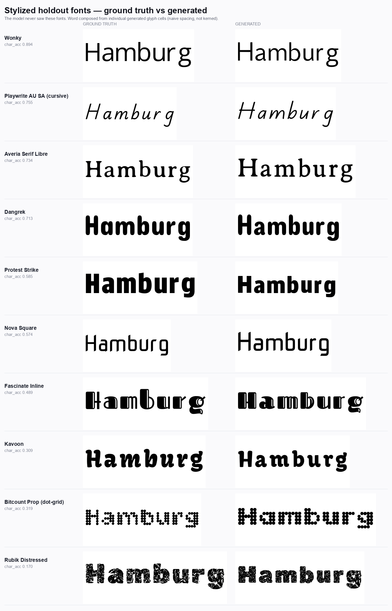
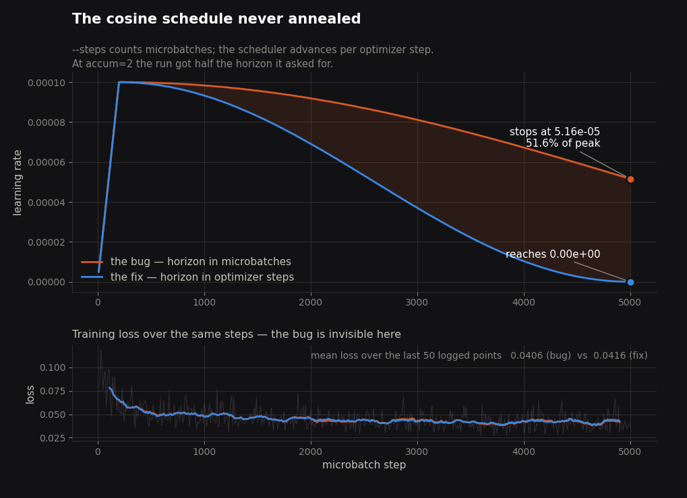
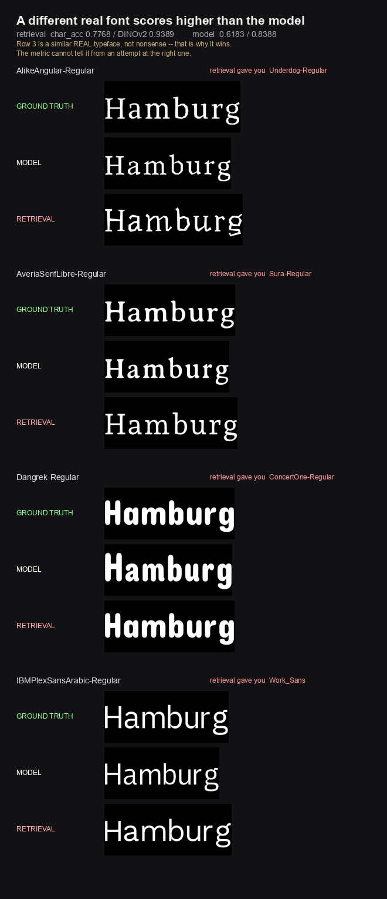
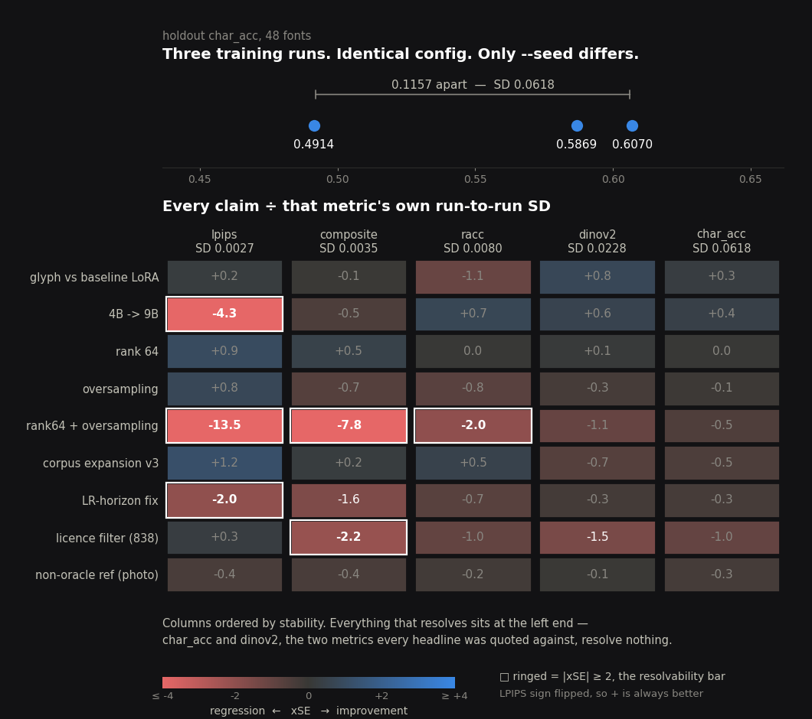
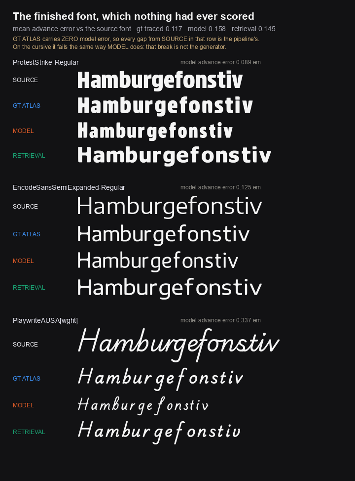
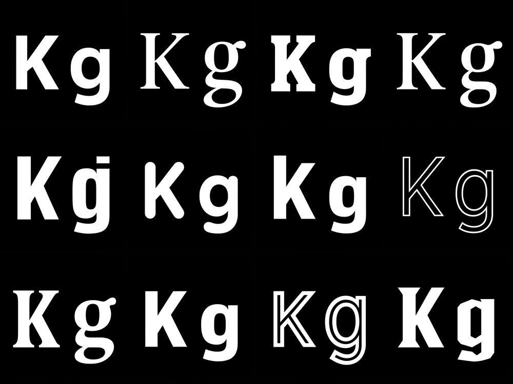
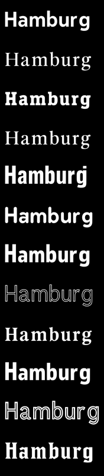

# What happened

A six-month account of building a font generator, trying to improve it,
discovering that nothing in the project could measure whether any of it had
worked — and then finding that the product was a different problem, with a
different gate, and needed instruments that use no ground truth at all.

This is the long version. The README has the short one. Every number below is
reproducible from a committed tool against committed artifacts.

---

## Act 1 — Build the thing

The goal: show a model two glyphs of a typeface it has never seen, and get the
other 92 back in the same style.

The approach is **glyph-latent channel conditioning**. A FLUX.2-klein diffusion
transformer is fine-tuned with a rank-32 LoRA, and the input is widened from 128
to 256 channels so a *glyph template* — a rendering of which character belongs in
which cell — travels alongside the noisy image latents. The template says
*"draw a K here, an m there"*; the reference image says *"in this style"*.

**Why the channel axis and not the obvious way.** The natural move is to append
the template as extra *tokens*. That doubles the sequence to 13,824 and, on one
RTX 3090, projects to roughly **nine days** per training run — which does not
merely cost more, it removes the ability to run an experiment at all. Attention
is quadratic in sequence length; concatenating along channels instead leaves the
sequence at 7,424 and pays only for a wider input projection. A run stays at
~4.4 hours. Every result further down this document exists because the unit of
work stayed small enough to repeat, and the run-to-run variance measurement in
Act 4 — three full trainings — would have been a month of GPU time under the
token design.

Concretely:

- `atlas_constants.py` — a 12×8 grid of 106×160 cells, 95 characters, one atlas
  per font. One source of truth; a drift here silently corrupts every crop.
- `train_lora_kg.py` — widens `x_embedder` 128→256, zero-initialises the new
  half so the model starts exactly where the base model was, and registers the
  widened layer in PEFT's `modules_to_save` so it survives serialisation.
- `generation_lib.py` — a forward-pre-hook injects the template at inference.
  Its load order (encode prompt → free text encoder → quantise → widen → load
  LoRA → move to CUDA → install hook) is load-bearing and documented as such.
- `atlas_to_font.py` — Potrace vectorisation of each cell into an OTF/WOFF2,
  with Adobe Glyph List naming, because 33 of the 95 characters are illegal as
  literal OpenType glyph names.
- `build_dataset.py` — 925 fonts, charset-filtered, near-duplicate-pruned.

**It works.** The model produces recognisable typefaces from one reference,
including hard cases: cursive joins, distress texture, and discontinuous
dot-grid topology.



*Ten holdout typefaces, ground truth above generated. The font files were held
out of training — though 32 of the 50 share a superfamily with a training font,
so this is a file holdout and not out-of-distribution generalization. Spacing is
naive and unkerned; that turns out to matter, and Act 5 returns to it.*

That much was never in doubt, and nothing later in this document overturns it.
Everything after this is about whether it got ***better*** — a question that
sounds like a smaller one and is not.

---

## Act 2 — Try to make it better

Five levers, each a full training run and a scored evaluation, each compared
with a paired Wilcoxon over per-font means and gated at `p<0.05 AND r≥0.3`:

| lever | idea | what the gate said |
|---|---|---|
| rank 64 | more adapter capacity | **no difference on any metric** — composite p=0.53, char_acc p=0.96 |
| distinctiveness oversampling | show unusual fonts more often | **no difference on any metric** |
| corpus expansion | 925 → 1,113 fonts | significant **regression** (composite r=0.64) |
| stacking | rank 64 *and* oversampling | significant **regression** (composite r=0.59) |
| base model | 4B → 9B | significant improvement — char_acc r=0.56, dinov2 r=0.56 |

Read that column on its own and Act 2 is already over. One lever of five moved
the headline metrics, and it was the one that swapped the base model for a
bigger one — which is not a technique, it is a purchase.

**That is not how it was read at the time.** When a headline gate came back
null, the argument moved to a *second* statistic: a "redistribution signature"
that split the holdout into hard and easy fonts and measured where each lever's
gain landed. On that statistic, every lever said something. The rank-64 note is
titled *"Rank 64 doesn't add capacity — it reallocates it toward hard fonts"*,
and its first section is headed, in the note's own words, **"The population
answer: no."**

A story assembled itself out of the second statistic: *quality moves from easy
fonts to hard ones; the adapter has a capacity ceiling.* It was published in the
README as **"Five levers, one ceiling."**

The pattern is worth naming, because it is the more general failure and it is
not dishonest: **the secondary statistic became load-bearing precisely because
the primary one was null.** A null headline with a consistent subgroup effect is
a real thing to investigate. But it put the entire weight of a five-lever
conclusion onto a statistic that had never once been run against a known-null
input.

---

## Act 3 — The instruments start failing

The first crack was in the statistic behind that story.

The "redistribution signature" split the holdout by difficulty and measured
where each lever's gain landed. But difficulty was defined from the *baseline
run* — and conditioning a delta on its own baseline is biased by construction:

```
Cov(a, b − a) = Cov(a, b) − Var(a)
```

Seed noise alone drives that negative. Measured on 12 pairs of **different
seeds of the same model**, where the true effect is exactly zero, the statistic
returned ρ = −0.253 and a spurious hard-vs-easy gap of 0.038.

**"Five levers, one ceiling" was retracted.** `tests/test_redistribution_null.py`
now pins the null so it cannot come back.

Once one instrument was wrong, the others got read properly:

- **`char_acc` is not what it claimed.** It is a *within-font nearest-neighbour*
  match — is this cell closer to its own ground truth than to any other glyph of
  the same font. Its own docstring says style is largely controlled for. It was
  labelled "style fidelity" for months.
- **R-ACC is OCR *consistency*, not correctness.** 30.7% and 31.9% of its
  "successes" are the OCR reading the same *wrong* string on both images.
- **IDENTITY 0.9936 is a lenient score.** It folds case and merges `0/o/O`,
  `1/l/I`, `5/s/S`. Exact 94-class identity is 0.9355, and the reported figure is
  computed on a gated subset that drops the 300 hardest cells.
- **The holdout is 46 fonts, not 50.** Two triples are byte-identical, so those
  typefaces carry triple weight. And two Bitcount fonts share a reference image
  but have *different* ground truth — the model emits identical output scored
  against two different answers, so it cannot do well on both by construction.
  Both had been cited as per-font evidence.
- **Confidence intervals were 4–8× too narrow.** The eval bootstrapped over
  *cells*, treating n as 4,700 when the effective n is the ~50 fonts — violating
  a rule the project had written down for itself.
- **The DPO track was never run.** Three negative results attributed to it were
  SFT self-distillation. The diffusion-DPO stage was built and then abandoned.

And two silent training defects that no loss curve could show:

- **The cosine LR schedule never annealed.** `--steps` counts microbatches; the
  scheduler advances per *optimizer* step. Every checkpoint took 2,500 updates
  against a 5,000-step horizon and stopped at **51.6% of peak LR** — derived
  5.1603e-05 against a logged 5.16e-05.
- **The SNR loss weighting is inert.** It normalises by the batch mean, which at
  batch size 1 is identically 1.0. Every checkpoint trained on plain unweighted
  velocity MSE.



*Both curves are parsed out of real training logs, not modelled. The buggy run
stops half way down the cosine and spends its last 2,500 microbatches at a
learning rate it should have annealed past. The panel below is why nobody
caught it: the two runs' loss curves are indistinguishable, and over the last 50
logged points the buggy run actually sits **lower** (0.0406 against 0.0416) —
which is what a permanently-high learning rate looks like when the training
objective is the only thing being watched. Regenerate with
`python viz/lr_horizon_bug.py`.*

---

## Act 4 — The floor drops out

Three measurements, in the order they landed.

### The oracle-reference gap is small (good news)

Every published number renders the reference from *the target font's own file*,
through the pipeline that made the ground truth. Real users upload screenshots.
The project's own roadmap predicted quality "WILL drop sharply."

Measured, with ground truth held identical and only the reference degraded:

| tier | reference px | char_acc | Δ |
|---|---|---|---|
| oracle | 1280 | 0.6183 | — |
| screenshot | 704 | 0.6140 | −0.0043 |
| upload | 486 | 0.6202 | +0.0019 |
| photo | 409 | 0.5930 | −0.0253 |

All inside noise. The mechanism is a free win: the pipeline resizes every
reference to 512×512, so anything above that is equivalent to the oracle.

*Caveat, stated because the test was partly mis-designed:* the screenshot tier
degraded **above** 512 and was nearly a no-op. The breaking point was never
found, because no tier was hard enough.

### Training-run variance — measured for the first time

Every variance figure the project had measured *inference* seeds. The spread
between two **training runs** had never been measured at all.

Three runs, identical except `--seed`:

```
char_acc run means:  0.4914 / 0.6070 / 0.5869
```

| metric | run-mean SD | gate fires on **identical** configs |
|---|---|---|
| char_acc | 0.0618 | 2 of 3 pairs |
| dinov2 | 0.0228 | **3 of 3 pairs** |
| racc | 0.0080 | 1 of 3 |
| composite | 0.0035 | 0 of 3 |
| lpips | 0.0027 | 1 of 3 |

Run `analysis/compare_runs.py` — the project's only comparison tool — on two
runs differing **only in the random seed**:

```
char_acc  p=0.0000  r=0.731  SIG (B better)
dinov2    p=0.0000  r=0.742  SIG (B better)
```

For scale, the README's flagship result was `r=0.768`.

The tool was never broken. It pairs by *font* and answers "is B better on more
fonts than A" — so a shift common to every font is invisible to it. Here that
common shift is 43–52% of the difference. It was being asked a question it does
not answer.

### A trivial baseline beats every model

Take a holdout font's reference, find the nearest font in the *training corpus*
by DINOv2, and hand back that font's ground-truth atlas. No model, no GPU:

| | retrieval | 9B glyph | 4B |
|---|---|---|---|
| char_acc | **0.7768** | 0.6917 | 0.6183 |
| dinov2 | **0.9389** | 0.8788 | 0.8388 |

Returning *a different real typeface* scores higher than generating the right
one. The two metrics the entire project optimised measure general
font-likeness, not generation.



*Same word, three sources. Row 3 is a **different real typeface** — and on Dangrek and IBMPlex it is hard to tell from the other two. That is precisely why it wins: nearest-neighbour retrieval returns something genuinely similar, and the metric cannot distinguish that from an attempt at the right font. Regenerate with `python viz/retrieval_vs_model.py`.*

And 8 of the 50 holdout ground-truth atlases are **byte-identical to training
atlases** — `Tirra == Akatab`, `JainiPurva == Jaini`, six more. Exact answer
leakage, found only when something finally hashed the two sets against each
other.

---

## Act 5 — What is actually left standing

### Effects that clear the noise

Scored on *every* metric against that metric's own training SD
(`analysis/claim_ledger.py`), six effects clear 2×SE. **All six are regressions.**

| effect | metric | ×SE |
|---|---|---|
| rank 64 + oversampling | lpips / composite / racc | **−13.5 / −7.8 / −2.0** |
| 4B → 9B | lpips | **−4.3** (the 9B is *worse*) |
| licence filter | composite | −2.2 |
| LR-horizon fix | lpips | −2.0 |



*Top: three runs whose configs differ only in `--seed`. Bottom: every claim ÷
that metric's own run-to-run SD, columns ordered by that SD. The ringed cells
are what clears 2×SE — all six are regressions, and all six sit in the two
left-hand columns. The two right-hand columns, char_acc and DINOv2, are the
ones every headline in this project was quoted against, and nothing in them
resolves. Regenerate with `python viz/variance_vs_effects.py`.*

Two things follow. **"Do not stack levers" is the best-supported claim the
project has** — and it is mechanically confirmed: the stacked run is 20%
over-inked against ground truth. And the flagship "the 9B is better" rests on
the two metrics that cannot resolve it, while the one that can says the
opposite. That is not an ink artefact; ink is 0.0638 vs 0.0632.

### The finished font was broken, and no metric could see it

Everything is scored on atlas *cells*. The product ships a traced OTF. Measured
on ground-truth atlases, where model error is exactly zero:

| | before | after |
|---|---|---|
| cap height vs source | 0.588 (**41% too small**) | **0.989** |
| advance width vs source | ~0.67 | **1.024** |
| line height | would have hit ~1.7 em | exactly 1.00 em |

`scale = upm / cell_h` assumed the em equals the 160px cell. It does not — the
dataset builder searches a per-font pixel size that *fits* the cell.

One thing stays wrong and **cannot be fixed here**: real fonts give each glyph
its own sidebearings; this pipeline gives them all the same one. The dataset
builder centres every glyph in its cell, so left and right gaps are equal by
construction. Recovering them needs a different atlas format and a retrain.

### So the finished font was finally scored — and it found a third defect

`analysis/score_finished_font.py` traces three arms through the *same* pipeline
and scores all of them against each holdout font's own source TTF: ground truth
(model error exactly zero, so its gap is the **pipeline's**), the model, and
retrieval. It immediately found a defect of the same family as the cap height:

**Every generated font set text at double word spacing.** The space is the one
glyph nothing is traced for — it is a blank cell — so its advance was *assigned*
as half a grid cell. That is 0.49–0.54 em against a source mean of **0.2635 em**,
and it was the worst glyph in **42 of 50 fonts**. No atlas metric can see it,
because the cell is blank by definition.

With that fixed, 50 fonts against their own source:

| arm | advance MAE | width err |
|---|---|---|
| ground truth traced | **0.1168** | **−0.0030** |
| retrieval | 0.1451 | +0.0119 |
| model | 0.1582 | −0.0764 |

**74% of the finished font's letterfitting error is the pipeline, not the
model** — ground truth, with zero model error, still misses by 0.1168 em per
glyph. And retrieval still wins (advance MAE p=0.017, r=0.337). No metric in
this project, atlas or finished-font, shows the model beating the
non-generative floor.

### The three defects turned out to be one

Eight days of finished-font scoring produced three defects that look unrelated,
and are not:

| defect | the builder had to invent | why |
|---|---|---|
| space 2× too wide | the space advance | the space has no cell — it is blank by definition |
| sidebearings all equal | one constant per glyph | the dataset centres each glyph in its cell |
| cap height assumed | absolute em scale | each font is rendered at a size that *fits* the cell |

**Every one is a number the atlas does not carry**, so the builder makes it up,
and every one is invisible to cell-space comparison by construction. That also
explains why the correct sidebearing model regressed: it fixed one invented
constant while the other two stayed wrong, and the one it replaced had been
absorbing their error.

The cap constant was then measured properly, and it was already right — corpus
median 0.7000 against a hardcoded 0.70, over 975 fonts. The holdout's 0.7105
was the *benchmark* having taller caps than the corpus (2.52 SE, p=0.015), which
is a fourth way the 50-font holdout is unrepresentative, not evidence about the
constant. The per-font scaling error has **SD 0.1060, three times its mean
bias**, and no constant can touch it.

So an atlas format v2 would have to carry per-glyph advances and the font's em
scale — a data-format change, which means a retrain. Until then `gt_traced`, the
ceiling with model error exactly zero, stays at advance MAE 0.1168 however good
the generator gets. The model is not the binding constraint on the artefact a
user receives.
([note](../research/2026-08-20-the-atlas-format-is-the-common-cause.md))



*Three holdout faces. GT ATLAS carries zero model error, so every gap from
SOURCE in that row belongs to the pipeline — and on the cursive it breaks
exactly the way MODEL does. Regenerate with `python viz/finished_font_specimens.py`.*

**The near-miss is the part worth keeping.** Before the space fix, the same tool
reported the model *beating* retrieval on text width (p=0.006, r=0.388). It was
an artefact: the model's systematically narrow glyphs were cancelling the
2×-wide spaces, and two errors of opposite sign summed to a near-perfect total.
Fix the space and the verdict becomes p=0.502, no difference. A day's difference
in the order of work and "the first metric where the model beats retrieval"
would have been published, and false.

That is a third error family, alongside the two below: **a compound metric
hiding two cancelling defects.** A sum is not evidence that its terms are right.
([note](../research/2026-08-18-scoring-the-finished-font.md))

### The licensing audit

Separate from the measurement work, and consequential:

- The corpus was **87.0% OFL, not the 97.5% published** — that figure counted a
  raw font checkout, not the 925 fonts actually trained on.
- **49 fonts carried vendor terms** permitting rendering but not redistribution
  or conversion — Arial, Georgia, Verdana, Segoe UI and others.
- **36 more were Fontshare closed-source** under a licence that explicitly
  claims derivative works as the foundry's property.
- 121 fonts had no provenance record at all, because they were copied into the
  scanned folder rather than fetched through the tool that records it.

`research/corpus_provenance.json` is now committed, so the claim is checkable
from a clean clone. `build_dataset` refuses fonts without a permissive manifest
entry. Training filters the corpus by default.

---

## Act 6 — The product turned out to be a different problem

The retrieval result is fatal to *this benchmark*, where the target is a real
held-out typeface and returning a similar real one nearly solves the task. The
intended product does not have that shape: the user describes a style, a
generative model draws the two reference characters, the user selects and
iterates. There is then **no target font**, and a similar real font is not a
near-miss — it is the wrong answer.

Probed on 2026-08-21, and it moved the risk rather than removing it. Given a
reference whose two glyphs disagree on style, the model neither picks one nor
fails: it **blends or splits**, emitting a light `H` followed by bold
`amburg`, or keeping inline striping on the `H` and losing it everywhere else.
The letter that keeps the reference style is the one nearest the supplied `K`.

Identity scored that **0.9034 against the control's 0.8910** — above it — and
the ink-coherence statistic returned p=0.970. Every letter is the right letter,
so both instruments are satisfied while the artefact is unusable. That is the
fourth time in this project a metric passed on a broken output, and the second
in four days that the eye caught what the instrument could not.

Two things follow. The human select-and-iterate loop is **load-bearing**, not a
nicety — it is the only thing between an inconsistent reference and a split
atlas. And a **GT-free style-coherence measure** was the project's most valuable
missing instrument, because the product cannot use any of the five metrics that
need a target font.
([note](../research/2026-08-21-two-styles-in-two-styles-out.md))

**That instrument now exists.** `analysis/style_coherence.py` scores whether an
atlas is one typeface, with no ground truth. The first attempt — raw ink spread —
returned p=0.970, because `.` and `M` differ enormously for reasons unrelated to
style, so it was measuring which letters these are. Z-scoring every feature
against **that character's** distribution over 250 real fonts, and keeping only
the residual, is the entire fix:

| | oracle | mixed | p | r |
|---|---|---|---|---|
| dispersion | 0.3368 | 0.4064 | **0.0021** | **0.435** |

Validated a second, independent way: the labels are *graded*, running from
serif-meets-dot-grid to sans-meets-sans, and the measure tracks that severity at
**ρ = +0.407, p = 0.0034**.

Two things about how it got there are worth more than the number. A hypothesis
of mine was **wrong** — I predicted the defect was bimodal and that a two-means
separation would beat plain dispersion; it scores p=0.313, and both statistics
are still reported so the claim stays checkable. And the first run, at n=12,
reached neither threshold (p=0.176, p=0.170) while the effect sizes were already
r=0.408 and ρ=0.424. **The effects barely moved on the way to n=50; only the
power did.** Two independent signals at r≈0.41 with p≈0.17 is the signature of
an underpowered comparison, not a null — the exact shape this project spent six
months learning to recognise, and the one time it was recognised *before*
concluding rather than after.
([note](../research/2026-08-21-a-gt-free-coherence-measure-that-works.md))

**And then the first piece of product rather than measurement.** The instrument
above scores a finished atlas. A *gate* has to score the reference, before a
generation is spent — and that is a different statistic, not the same one
re-used: dispersion over 94 cells versus a **distance** between two style
vectors. Dispersion over n=2 is meaningless.

`analysis/reference_gate.py` scores the two supplied glyphs. On the 50 coherent
and 50 mixed references already on disk:

```
separates the arms   p=0.0000   r=0.678
predicts the atlas   ρ=+0.666   p=0.0000   n=100
```

Prediction is what makes it a gate rather than a description — the reference
score tells you what the atlas will look like *before you generate it*. Its
signal is **stronger than the atlas measure it protects** (r=0.678 against
0.435), which is the expected direction: the reference is the cause and the
atlas a noisy effect.

The thresholds are provisional by construction, cut from the coherent
references' own spread rather than from references a human judged unacceptable
— that calibration set does not exist, and building it is a judgment task, not a
measurement one. And its recall is a *floor*: the `mixed` label includes benign
pairings that produce a usable font and should pass.

The score also reports **which feature disagrees** — weight, slant, fill, or
topology — so a rejection is a re-roll instruction rather than a refusal.
([note](../research/2026-08-21-the-reference-gate.md))

**And then the gate stopped being a script and became the product.** It is wired
into `app.py` ahead of `get_pipeline()`, so a disagreeing pair costs nothing
rather than a minute of transformer time — an ordering a test now pins, because
the first version ran the check *after* loading the model and was therefore
correct and useless. It fails open: anything it cannot score is generated
normally.

### The research rounds, and two closed tracks that had gone stale

Before building the reference generator, three parallel-agent survey rounds
asked what should draw the two glyphs. The surveys returned one structural fact
and two corrections.

The fact: **no benchmark for inventing a coherent typeface exists.** Text
rendering benchmarks measure whether a model can write legible words in *some*
typeface; nothing measures whether two letterforms belong to the *same* invented
one. So the comparison had to be run rather than reasoned about — and the
coherence measure above has no published equivalent to be checked against.

The corrections both landed on `CLAUDE.md`'s closed-tracks list, and both went
the same way:

- **"Qwen-Image-Edit-2511 does not fit 24 GB"** was true at BF16 (45 GB) and
  false at INT4 (11–16 GB). It is Apache-2.0 and edit-native, which matters more
  than the fit: restyling a neutral `Kg` pair rendered from *one* font makes
  consistency **structural** rather than emergent, because both glyphs receive
  the same transformation in the same pass.
- **"Z-Image-Turbo has no image-conditioning path"** was true when it was
  checked and is not true now — `ZImageImg2ImgPipeline` plus ControlNet Union
  2.1, 6B, Apache-2.0, 6 GB quantised, 3.4 s at 8 steps.

Neither correction is interesting as a model fact. What is interesting is that a
*closed* track went stale silently: nothing in the repository signalled that a
verdict had expired, and the entries carried no date to check against. A survey
verdict is a measurement with a timestamp, and this record had been treating
those verdicts as conclusions.
([restyle](../research/2026-08-23-restyle-not-generate-the-reference.md) ·
[the field](../research/2026-08-23-the-permissive-local-field-opened-up.md))

### The obvious candidate was the one already loaded

Before downloading anything, the two complete local models were worth trying.
The first — **this project's own Apache-2.0 base**, `FLUX.2-klein-base-4B` —
passed on the first run.

Twelve style descriptions, one generation each, both letters in a single call:

| method | n | coherence mean | worst | reads as `Kg` |
|---|---|---|---|---|
| **REAL (control)** | 50 | 0.793 | 2.036 | 98% |
| **flux2-klein-base** | 12 | 0.958 | **1.331** | **100%** |



Twelve of twelve cleared the gate at its 1.875 threshold, every glyph read as
the right character, and the **worst** invented reference beat the **worst real
one**. 25.4 s per image, no download, no new dependency, no licence.

One design decision is worth more than the table. **Malformed candidates are
rejected with a reason, never silently scored.** A generated image is not
guaranteed to hold one letter per half, and the gate would happily return a
confident number about nothing. Nothing was rejected on this run — but a method
producing 80% garbage would otherwise have measured as merely mediocre, and the
bake-off would have been measuring the wrong thing.
([note](../research/2026-08-23-candidate-evaluation-round-1.md))

### The loop closes

Those twelve references then went through the generator, which is the test the
gate only *predicts*:

```
"a rounded soft sans with fully rounded stroke ends"
  → FLUX.2-klein-base-4B, 25 s   → two-glyph reference (Kg)
  → analysis/reference_gate.py   → 0.811, well inside the 1.875 threshold
  → glyph-conditioned LoRA, 62 s → 94-glyph atlas
  → glyph_classifier.py          → identity 0.9043 — a usable font
```

Those are that one font's numbers. The first write-up of this chain quoted the
twelve-font *means* (0.958 and 0.9379) inside a single-font trace — a small
error, corrected in the note, and worth mentioning only because it is the same
shape as the mistakes catalogued at the end of this document: a number that is
right about a set, presented as though it were about a member.

| arm | n | identity | lenient | confidence | ink CV | coherence |
|---|---|---|---|---|---|---|
| **oracle** (real font references) | 50 | 0.9081 | 0.9855 | 0.868 | 0.4458 | 0.3368 |
| **external** (references invented from text) | 12 | **0.9379** | **0.9982** | **0.886** | **0.4330** | **0.3137** |



Twelve legible words, **each internally consistent** — one typeface per row, no
splitting along the K-like / g-like seam. Atlases built from *invented*
references beat atlases built from *real held-out font* references on every
ground-truth-free metric available.

**That comparison is confounded, and the confound is the point.** The oracle
arm's 50 fonts include the genuinely hard cases — dot-grid Bitcount, heavy
distress, cursive Playwrite — while all twelve invented styles came back as
conventional letterforms. **The generated set is easier, and both instruments
reward that.** Stated here because it will otherwise be tempting to quote the
table without it.

What the run *does* establish is the thing that was actually at risk. The live
question was whether a reference not rendered from a font file would be out of
distribution and break the generator — the reference-degradation study never
found a breaking point because no tier was hard enough, and a synthetic
reference is a distribution *shift* rather than a degradation. It does not
break. Identity holds, coherence holds, and no arm needed a single rejected
candidate. That risk is retired, and it was the main one.
([note](../research/2026-08-23-the-loop-closes.md))

### The third axis has no instrument, and generic CLIP is not it

Two of the three axes now have validated instruments. **Coherence** says the
font hangs together; **identity** says the letters are right. Neither says the
font is the font you asked for.

Eyeballed across both stages, roughly nine or ten of twelve prompts hit the
described style. *"A stencil sans with deliberate breaks"* produced a solid face
with no breaks at all, at the reference stage **and** the atlas stage — and
identity scored it **0.9787, among the highest of the twelve**. That is the
fifth time here a metric has passed on a broken output, and the starkest: the
instruments were not merely silent about the clearest failure in the set, the
one that spoke rewarded it.

Adherence is a different *shape* from the other two: it compares an image
against the **text that asked for it**, which is CLIP's native job. So CLIP was
tried, three times, and the sequence is the useful part:

| test | result |
|---|---|
| ranking, 1-of-12 | 17% top-1 against 8% chance — **failed** |
| permutation over the image↔prompt bijection | p ≈ 2e-05 — real, but not adherence |
| **minimal pairs, pre-registered** | **6/12, p = 0.61 — chance** |

**The middle result is where this went wrong, and an adversarial review caught
it rather than I did.** Having failed a bar I set, I ran a second statistic on
the same matrix, passed, and defended it as "a different question, not a relaxed
bar". It was not: `win_rate == (n − rank) / (n − 1)` **exactly** — a monotone
transform of the rank I had just said I abandoned. The same review found I had
labelled a third prompt "missed" *after* seeing it score third-lowest, when both
prior notes recorded **two** misses; correcting that moved one p-value from
0.0045 to 0.0152 and another from 0.018 to **0.0909**, which is not significant.
And it found a confound I had never checked: prompt-column means span
0.202–0.263 and *"condensed grotesque"* is the top match for **11 of 12** images,
so a low diagonal can mean the prompt scores low against everything.

The tests were no better than the claims. The first suite imported constants,
never executed the statistic, and **skipped when its data file was absent** — so
a missing result produced a green run, which is the exact failure the file
claimed to guard against.

So the third attempt was **pre-registered**: hypothesis, statistic, bar,
backbone and tie-handling fixed in the tool's docstring and committed to git
*before* the numbers existed, with `IF IT FAILS Reported as a failure` written
into the same docstring. Each prompt was paired with a negative differing in
**one** decisive attribute, wording otherwise held close so the column confound
cancels.

```
own prompt wins 6/12    exact binomial p = 0.6128    PRE-REGISTERED BAR p<0.05: FAILED
```

**The margins are the finding.** The decisive clause moves cosine similarity by
±0.001 to ±0.036 — about 1% of a 0.24 baseline. On the most visually obvious
attribute in the set, an image that plainly *has* a white stripe inset in each
stroke, CLIP scored *"solid, filled strokes and no inline stripe"* **higher**.

One case is worth keeping for a different reason. CLIP preferred "solid,
unbroken" for the stencil prompt — and the image **is** solid, because that
generation missed. Counted as a loss under the registration, correctly. That
single case is the whole adherence problem in miniature: **a measure that scores
an image against the prompt that requested it cannot distinguish "the model
obeyed" from "the model disobeyed and the measure noticed"** without a label
saying which. It is exactly why the earlier reading was circular.

The pre-registration produced a clean failure needing no correction, no
multiplicity argument and no defence — which is worth more than the ambiguous
pass it replaced, and is the one methodological habit from this project worth
carrying forward unchanged.

**The replacement was registered the same way, and it caught two more of my own
errors before producing a number.** The registered alternative to CLIP was a
discriminative per-attribute measure trained on real fonts, justified with one
sentence written into three documents and never checked: *"the labels are free
because the fonts' own metadata supplies them."*

Checked over 11,383 licence-clean files, **it is true for five attributes and
false for the two that motivated it**. Weight has 679 labelled families and
slant 389; **stencil and inline have ten families each**. The supply is rich
exactly where the generator already succeeds and empty exactly where the eye
caught it failing. Writing the census as a tool also found that I had counted
*files* where only *families* can be held out — width is 4,556 files and 59
families — and that reading PANOSE `bSerifStyle` without checking `bFamilyType`
had overstated serif labels **3.5×**, mislabelling every decorative face.

Of the attributes that can be labelled, six features reused unchanged from
`style_coherence.py` separate four of them on held-out families: weight 0.970,
monospace 0.946, slant 0.915, width 0.839, with serif-vs-sans weak at 0.733
because no feature measures terminal shape.

**Monospace at 0.946 refuted a prediction made an hour earlier, and the
mechanism is the lesson.** `render_atlas` centres each glyph on its ink bounding
box, so advance width is discarded — and monospace is *defined* by equal
advances. The reasoning is sound and the conclusion was wrong: mono designers
compensate in the ink, giving the `i` slab serifs and squeezing the `m`, so the
uniformity is drawn into the glyphs and survives centring. **An attribute is
carried by whatever a designer drew to express it, not by the metric that
defines it.** Reasoning from the definition would have dropped it.

None of that is an instrument yet. Separating real fonts is an easier problem
than scoring a generation, and that transfer was the next registered step.

**It passed, and its own descriptive output killed the interpretation.** Both
prompts the eye had recorded as hits ranked first on the attribute they asked
for, and neither recorded miss did. Then the column printing *which* atlas each
model liked best showed that **the stencil model's favourite was the inline
one**, and the outline second. `parts` counts connected components, so it reads
"in many pieces" — and a break, a stripe and a hollow contour are all many
pieces. The primary was satisfied by a mechanism that had nothing to do with
stencils. Reporting only the primary would have been true, pre-registered, and
misleading.

**The fix was topological, and it is the first thing here that reads an
adherence failure as a failure.** Solid, stencil, inline and outline were
synthesised from the *same* source faces, so the typeface is controlled for and
only the treatment is left to learn, and two features were added — a hole count
and a hole area. The stencil signature turned out to be the opposite of the
obvious guess: erasing bands cuts the counters **open**, so a stencil face has
*fewer* holes than a solid one, not more.

On the eleven real stencil and inline typefaces the corpus actually contains —
collapsed to superfamily, because `BigShouldersStencil` and
`BigShouldersInline` are one face — it scores **10 of 11, p = 0.0059** against a
bar committed before the run. BigShoulders is correct on both sides, which is
the only row where the typeface is held constant.

And on the twelve generated atlases it recovers, unprompted, all three judgments
written down two days earlier: the stencil request is **solid**, the inline
request is **inline**, the hairline is an **outline**. The stencil row is the
one that matters. That generation was called excellent by every prior instrument
in this project, and identity scored it **0.9787**.

**The caveat is the next problem and it is large.** Unrestricted, the same
measure scores **4 of 11** — seven real faces read as "solid" when it may pick
any class. It ranks and it does not calibrate, which is now the twice-observed
pattern, the weight model having saturated identically. Calibration, not
separation, is the bottleneck.
([carried](../research/2026-08-24-what-the-atlas-carries.md) ·
[transfer](../research/2026-08-24-the-transfer-test-passed-and-that-is-not-the-finding.md) ·
[break vs stripe](../research/2026-08-25-a-break-is-not-a-stripe.md))
([retraction](../research/2026-08-24-style-adherence-the-wrong-formulation-failed.md) ·
[the failure](../research/2026-08-24-clip-does-not-read-the-decisive-clause.md))

---

## Act 7 — The interface decides what the instruments must do

The owner settled a question I had been carrying as an open decision: **the
product shows several candidates and lets the user pick and iterate.**

That is a design choice, and it re-graded the instruments. The adherence measure
became a **ranker** rather than a gate, so *"it ranks and it does not
calibrate"* — named the bottleneck a day earlier — stopped being blocking. A
mis-ordered list costs a user nothing; every option is shown. A wrong
*rejection* costs them a good font silently, so `reference_gate` should filter
rather than refuse. And the human becomes the adherence ground truth: someone
shown four options and picking one produces a real label, free, at every
interaction.

It also created one requirement nothing had ever measured. **The options must
differ.**

### Four questions, four measurements

| | question | answer |
|---|---|---|
| 1 | can we make N candidates per description? | `--n`, with `n=1` labels preserved |
| 2 | do the options actually differ? | ratio **0.518**, p=0.0005 |
| 3 | can two glyphs be scored, or must we wait for an atlas? | **9/11**, p=0.0327 |
| 4 | does the atlas track the reference the user picked? | **11/16**, p=0.0003 |

Question 3 mattered because selection at the reference stage costs ~25 s and at
the atlas stage ~62 s with three atlases thrown away. Two glyphs carry the
signal — **barely**. 9/11 is the bar, not a margin: one more error reads
p=0.113. The extra error lands on `BigShouldersInline`, the only pair where the
typeface is held constant and the measure must separate *treatment* from *face*.

Question 4 excluded the atlas's own `K` and `g`. The model is conditioned to
copy those, so matching them would measure the conditioning rather than the
transfer. Scored on the other 92 cells, the style reaches the letters nobody
chose.

**The architecture holds end to end**: four options, selection on two glyphs,
one atlas — about 2.7 minutes per font.

### And the same measurement said the picker is rarely load-bearing

Spread runs **0.454 to 3.960** across the twelve descriptions, and it is
narrowest exactly where the generator fails. Four seeds of *"a stencil sans with
deliberate breaks"* produce four solid faces.

Taken further, on the gate's own 1.875 cut, **eight of twelve descriptions offer
no pair the instrument would call a different style**. The picker is sound and,
on two-thirds of prompts, choosing between four renderings of one idea. The app
now says so and offers to reword rather than re-roll.

So the constraint was never selection. It was **variety**, which is the
generator's.

### Three days spent proving it was not the generator either

A second arm was the only item that could lift the ceiling rather than describe
it. GLM-Image did not run at all — the 13 GB int4 build has no quantizer in
diffusers 0.38, and the bf16 checkout segfaults, which means this document's own
*~36 min/image* figure for it is **unre-measured rather than confirmed**.
Z-Image-Turbo did run, and returned four more solid faces.

Then the edit path: render a neutral `Kg` and ask the same weights to *restyle*
it. The strength sweep resolved the hoped-for middle ground out of existence —
up to 0.70 the model returns the source essentially untouched, and at 0.90 it
produces a heavier sans, still solid.

**Sixteen images, three mechanisms, no break anywhere.** Every one of them asked
a general image model to *draw* a rare typographic treatment from a description.

### The answer was in the repository the whole time

`synthesize_rare_attributes.py` **constructs** stencil glyphs geometrically —
that is how it builds its training data. Nothing had asked whether the LoRA can
**transfer** a treatment it is *handed*.

Three arms, one seed, scored over the 92 cells excluding `K` and `g`:

| arm | parts | holes |
|---|---|---|
| plain | 0.736 | 0.203 |
| inline *(positive control)* | 0.754 | **1.332** |
| **stencil** | **2.148** | **0.015** |

Stencil nearly tripled the component count while collapsing holes to nothing —
breaking bands cut the counters open — and the inline control did the mirror
image. **Both moved in their own directions and only in those**, which is what
separates a transfer from a model reacting to any altered reference.

The positive control nearly failed to exist. Its first version changed 6.58% of
the ink where it should remove half a stroke, and my first explanation for that
was wrong. The cause was a global `dist.max()` threshold — correct in a 106×160
cell, useless on a 1024px reference where a `K`'s junction sets the peak. The
shared transform was left untouched, because the classifier result depends on
it, and the probe got a local-ridge variant instead. That repair happened
**before** any measurement, which is the whole difference between it and the
style-adherence retraction.

**So the product answer for rare treatments is to synthesise the reference
rather than generate it.** Three days of negative results turn out to have shown
that the *reference-drawing stage* cannot make a stencil — not that the system
cannot. That stage is the one part of this pipeline replaceable with geometry,
and the rare-attribute vocabulary is now bounded by what can be **constructed**
rather than by what a model will draw.
---

## The harnesses

The instruments outlived the findings. 62 analysis tools, 54 test files.
The ones that earned their place:

| tool | what it does |
|---|---|
| `training_variance.py` | run-to-run SD per metric; shows what the gate does on identical configs |
| `claim_ledger.py` | every claim × every metric ÷ that metric's own SD |
| `retrieval_baseline.py` | the non-generative floor, with a leak guard |
| `compare_runs.py` | paired Wilcoxon, now with integrity guards and a printed scope warning |
| `multiseed_compare.py` | fonts and seeds resampled separately; **pre-registered before its data existed** |
| `check_holdout_integrity.py` | hashes the benchmark against itself |
| `audit_corpus_provenance.py` | tracked licence manifest, `--check` mode |
| `sanitize_for_publish.py` | pre-publication gate; warns when redaction touches code |
| `build_degraded_holdout.py` | reference degradation tiers with ground truth held fixed |
| `seed_variance.py` | inference-seed main effect vs font×seed residual |
| `score_finished_font.py` | scores the traced OTF, not the atlas; splits pipeline cost from model cost against the source TTF |
| `measure_ink.py` | stroke-weight shift that loss cannot see; encodes the light-on-dark polarity that made the first measurement wrong |
| `style_coherence.py` | is this atlas **one** typeface? No ground truth, which is what the product requires |
| `reference_gate.py` | the same question about the two supplied glyphs, *before* a generation is spent — a distance, not a dispersion |
| `generate_candidate_references.py` | the reference-generator bake-off harness; **rejects malformed candidates with a reason** rather than scoring them |
| `style_adherence_minimal_pairs.py` | bar committed to git before the run, so the timestamp proves it preceded the data |

Several tests exist purely to pin a bug's *reason* so the fix cannot be quietly
undone: `test_redistribution_null.py`, `test_lr_schedule_horizon.py`,
`test_bootstrap_clusters_by_font.py`, `test_multiseed_compare.py`,
`test_eval_exit_codes.py`, `test_style_adherence.py`.

That last one pins something worth stating plainly: **`eval_checkpoint.py` could
not exit non-zero.** It ended with a bare `main()`, so every runner's
`|| fail eval $?` was inert, and each wrote its `_DONE` marker after an
evaluation that had refused to run.

---

## What did and did not work

**Worked**

- **The conditioning mechanism — and it is the one claim here that a
  replication crisis cannot touch,** because it is an ablation of a single
  model rather than a comparison of two training runs. Zero the template
  channel and hold everything else fixed: identity falls 0.5609 → 0.0406,
  keeping 7%, while DINOv2 keeps 81% (0.7295 → 0.5887). Style survives the
  ablation and letterform identity does not. The reference image was already
  carrying style; the template channel is what carries identity, which is
  exactly the split the architecture was built to create. The effect is an
  order of magnitude, not a 2×SE argument.
- The engineering: atlas format, quantised training on a single 24 GB card,
  vectorisation, the licence pipeline.
- Adversarial review. Nearly every finding here came from attacking a result,
  not from running another experiment.
- Pre-registration, twice, and the second time it was the whole point.
  `multiseed_compare.py` was written and committed before its data existed,
  because three earlier conclusions had turned out to depend on choices made
  after seeing the numbers. `style_adherence_minimal_pairs.py` was then
  pre-registered *after* an adversarial review caught exactly that failure
  happening again — and the result was a clean failure that needed no
  correction, no multiplicity argument and no defence.
- **The product reframing.** A style described in words produces a coherent
  94-glyph typeface, end to end, in ~90 s on two Apache-2.0 models already on
  disk. The risk that mattered — a reference not rendered from a font file being
  out of distribution — is retired. Two of the three axes it needs have
  validated ground-truth-free instruments.

**Did not work**

- Every training lever. Not "was tried and lost" — *was never measurable*.
- Best-of-N selection. The reserve is real (+0.12) but nothing harvests it.
  Per-cell medoid captures 4.2%; classifier confidence scores *worse than doing
  nothing*, because identity confidence and style proximity are orthogonal
  (ρ = 0.038 over 8,460 cells). Three selectors, one mechanism, family closed.
- Corpus expansion. Regressed, with three confounds, none isolated.
- The DPO track. Built, never run.
- **Generic CLIP as a style-adherence measure.** Ruled out on a pre-registered
  minimal-pair test at exactly chance (6/12, p=0.61). The decisive clause moves
  cosine by about 1%. The third axis still has no instrument.

---

## To be continued

This is a stopping point, not a conclusion. The work now splits into two tracks
that must not be quoted against each other, because they do not share a gate.

### The live track — the product loop

1. **An adherence instrument.** One axis of three, and the one that decides
   whether a described style is actually delivered. Generic CLIP is ruled out on
   a pre-registered test. Next candidates in order: **FontCLIP** (arXiv
   2403.06453), a vision-language model adapted to font attributes, which exists
   precisely because generic CLIP lacks this vocabulary; failing that, a
   **discriminative** per-attribute classifier — stencil vs solid, inline vs
   filled, light vs heavy — trained on rendered real fonts. That is a different
   and more tractable problem than open-vocabulary alignment, the labels are free
   because font metadata supplies them, and 925 licence-clean fonts are already
   on disk.
2. **The other generator arms.** One of four is measured, and the harness now
   exists: `analysis/generate_candidate_references.py`, with `--from-dir` for
   hosted arms so no client code is needed here. **GLM-Image int4** (on disk,
   MIT, Glyph-ByT5 encoder — and its ~36 min figure was measured on a bf16 run
   that was paging, so it also needs re-measuring), **Z-Image-Turbo** (6 GB,
   3.4 s), **Qwen-Image-Edit-2511** at INT4, and Nano Banana Pro.
3. **Calibrate the gate against human judgement.** Its thresholds are cut from
   the coherent references' own spread, not from references a person judged
   unacceptable. That calibration set does not exist, and building it is a
   judgment task rather than a measurement one. Its recall is also a *floor*:
   the `mixed` label includes benign pairings that produce a usable font and
   should pass.
4. **Score the finished OTF.** Everything in the loop is atlas-space, and 74% of
   the finished font's error belongs to the pipeline's invented constants
   regardless of which model drew the glyphs.

### The parked track — the model

1. **Build a benchmark retrieval cannot solve.** This is the precondition for
   everything else. `docs/benchmark-v2-spec.md` has a design — 60 fonts, one per
   superfamily, sealed and used once — but it must additionally satisfy one hard
   acceptance criterion: *nearest-neighbour retrieval must fail on it.* Today it
   nearly solves the holdout.
2. **Move the primary metric to the finished font — started, and it paid
   immediately.** `analysis/score_finished_font.py` scores the traced OTF
   against each holdout font's own source TTF. It found the 2× word-spacing
   defect, showed that 74% of the letterfitting error belongs to the pipeline
   rather than the model, and confirmed retrieval still wins. Still missing:
   kerning, which no arm has, and replicates on the model arm.
3. **Budget for replicates.** Any future training comparison needs ~3 runs per
   arm, or an effect larger than 2× that metric's SD. Composite (SD 0.0035) is
   8–20× more stable than char_acc and should be the headline.
4. **Resolve the corpus provenance** before any weights are published. 85 fonts
   are known-problematic; that is a retrain, not a relabel.
5. **Harvest the best-of-N reserve, or prove it unharvestable.** The constraints
   are now sharp: the signal must be *per-cell* (confirmed, p=0.0004) and *in
   style space* (identity space measured useless).

### The two gates

> **Model track.** The model must beat the retrieval floor, on a metric that
> measures generation. Neither of those exists yet.
>
> **Product track.** A described style must demonstrably produce *that* style.
> There is no instrument, so the claim currently rests on my own eye — the
> weakest evidence in this document.

The first is a bigger and more interesting problem than any of the levers. The
second is the one the product cannot ship without, and it needs no GPU at all,
which is the main reason it comes first.

**The retrieval floor is a gate on the model framing only.** The product has no
target font, so nearest-neighbour retrieval has nothing to retrieve against. The
floor that made the model track hard is simply absent from the product track,
and reading either result as evidence about the other would repeat, in a new
form, the cross-metric mix-up this project has now logged three times.

---

## A note on method

Roughly eighteen published findings in this repository were corrected or
retracted. Six of those corrections were to work done in the same session that
produced it, including a headline result revised within two hours of being
announced.

The errors cluster into four families, and none of them is visible to the
primary metric:

1. **Statistics conditioned on the thing being measured** — the redistribution
   signature, the hard/easy split, a distinctiveness moderator that fell from
   ρ=0.761 to ρ=0.247 once baseline was controlled.
2. **Silent contract mismatches** — prompt style, template drift, LR units in
   microbatches, `bool()` coercing continuous metrics to 1.0, `glob` reading
   `[wght]` in a font name as a character class and silently dropping 12 of 48
   fonts.
3. **Compound quantities hiding cancelling defects.** Twice, days apart. The
   finished font's total text width read as near-perfect because glyphs that
   were systematically too narrow were absorbing spaces that were 2× too wide —
   and it briefly read as the model beating the retrieval floor. Then a
   *correct* per-character letterfitting model, worth −14.6% measured against
   real ink, delivered 0.3% in the pipeline and made text width 6 points worse:
   the flat sidebearing it replaced had been compensating for the tracer
   under-measuring ink by 3.5%. Both times the sum looked healthier than any of
   its terms, and both times the fix for one term alone was a regression.
4. **Hypotheses generated by the outcome they are then tested against.** The
   style-adherence work is the clean specimen, and it is the only family on this
   list I could not have caught by checking a number. I set a bar, failed it,
   ran a second statistic on the same data, passed, and defended it with a
   distinction that was arithmetically false. In the same write-up I called a
   third prompt "missed" after seeing it score third-lowest, when both earlier
   notes had recorded **two** misses — which moved one p-value from 0.018 to
   0.0909. Every individual step felt like ordinary analysis at the time.

No family announces itself. Loss was healthy through the LR bug. char_acc was
healthy through the conditioning bug. The width metric was healthy through both
of the defects composing it. Each was found by someone checking a thing nobody
had thought to check.

The fourth family is different in kind, because there is no thing to check —
the data is fine and the arithmetic is right. Only two things caught it: an
adversarial review by a model that had not watched me form the hypothesis, and
then a bar committed to git before the numbers existed. Those are the two habits
worth carrying out of this project.

That is the actual result of it.
