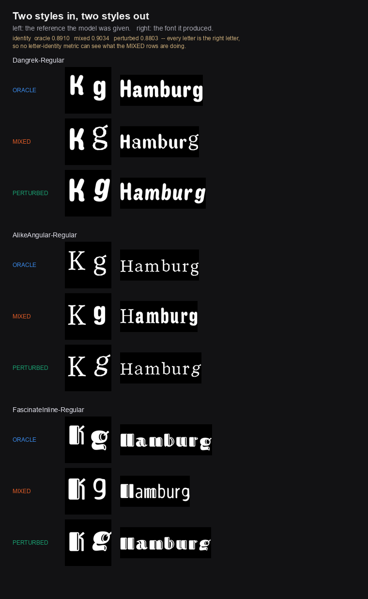

# Two styles in, two styles out — and no metric here can see it (2026-08-21)

**The product concept is viable, the human select-and-iterate loop is
load-bearing, and the defect that makes it load-bearing is invisible to every
GT-free metric this project has.**

Tools: `analysis/build_synthetic_references.py`,
`analysis/synthetic_reference_probe.py`, `viz/synthetic_reference_probe.py`.
Data: `research/synthetic_reference_probe.json`.

## Why this was asked

Every reference this project has evaluated was rendered from the target font's
own TTF. The intended product is different: the user describes a style, a
generative model draws the two reference characters, the user selects and
iterates.

That reframing matters more than it looks, because **it removes the ground
truth**, and with it the reason `2026-08-13-a-retrieval-baseline-beats-every-model.md`
was fatal. Retrieval wins by handing back the nearest *training* font. That is
near-optimal when the target is a real typeface resembling training fonts —
which is exactly what the 50-font holdout is. When the target is a style the
user just invented, "a similar real font" stops being a near-miss and becomes
the wrong answer.

The precondition: does the generator still work when its reference is not a
clean single-font rendering?

## The design

Three reference arms, same checkpoint (`glyph_4b_r32_5000/checkpoint-5000`),
same seed 42 for every arm and font so the arms differ by **reference only**:

| arm | reference |
|---|---|
| `oracle` | the shipped reference, verbatim. Control. |
| `mixed` | `K` and `g` from **different superfamilies** |
| `perturbed` | same face, right glyph slanted and weight-shifted |

Two construction details that were bugs first. The shipped references render
**`Kg`**, not the `Rg` the checkpoint's conditioning records — the documented
train/eval mismatch, measured not to matter (p=0.625). The synthetic arms had to
match the *control*, or style inconsistency would be confounded with glyph
identity. And the `mixed` partner is chosen by **superfamily**, not alphabetical
neighbour: the holdout carries five Playwrite faces and three IBMPlex, so
neighbours are frequently the same family and the arm would have been
accidentally style-*consistent*, testing nothing.

Scoring is GT-free by necessity — there is no target font in the product.
`identity` is the font-invariant classifier; `ink CV` is within-atlas ink
spread.

## The numbers say nothing happened

12 fonts × 3 arms, 36 generations:

| arm | identity | lenient | confidence | ink CV |
|---|---|---|---|---|
| `oracle` | 0.8910 | 0.9770 | 0.852 | 0.4385 |
| `mixed` | **0.9034** | 0.9832 | 0.868 | 0.4759 |
| `perturbed` | 0.8803 | 0.9637 | 0.854 | 0.4343 |

Paired Wilcoxon against the oracle: **no difference on anything**
(`mixed` identity p=0.625, ink CV p=0.970). Several tests returned `nan` —
every pair tied exactly, the near-ceiling behaviour `CLAUDE.md` warns about.

The `mixed` arm scored *higher* than the control on identity.

## What actually happened

The model neither picks one style nor fails. It does one of two things:

- **Blends.** Dangrek's heavy `K` meets a light serif `g`, and the whole word
  comes out lighter than the oracle's.
- **Splits.** AlikeAngular emits a **light `H`** followed by **bold `amburg`**.
  FascinateInline keeps its inline striping on the `H` and loses it everywhere
  else.

In both split cases the letter that keeps the reference style is **`H`, the
letter nearest the supplied `K`**. The model applies the K-style to K-like
letterforms and the g-style to the rest, so an inconsistent reference yields an
atlas that is internally inconsistent *along the same seam*.

Every letter is the correct letter. That is why identity is satisfied, and why
it read 0.9034 — above the control.

## Three conclusions

**1. The generator is not the risk.** It transfers style faithfully. The
`perturbed` arm proves the same point from the other side: slant the reference
`g` and the output is a coherent italic. Consistent style in, consistent style
out.

**2. The select-and-iterate loop is load-bearing, not a nicety.** The concept's
human step is the only thing standing between an inconsistent reference and an
unusable font. That is a design validation, and it also implies a concrete
feature: **check the two reference glyphs for mutual style consistency before
spending a generation**, and reject or re-roll rather than producing a split
atlas.

**3. My own coherence metric failed.** `ink CV` was built to detect exactly this
and returned p=0.970. It is dominated by *letter* identity — `.` and `M`
legitimately differ enormously — and the incoherence here is bimodal across
glyph shape, not a variance increase. A GT-free style-coherence measure is now
an open problem, and it is the measurement the product needs most.

## Caveats

- **12 fonts, one seed, one checkpoint.** The paired design cancels the seed
  across arms, but nothing here estimates run-to-run variance on these metrics.
- **No real generated references were tested.** `mixed` and `perturbed` are
  constructed proxies for what a text-to-image model does wrong. The
  `--external-dir` arm exists to take real ones; it is empty.
- The arms preserve the two-column layout, shared baseline and canvas. A real
  generated reference may also break the *format*, which this does not test.
- `identity_lenient` sits at 0.96–0.98 and is saturated; quote `identity_exact`.

## For the record

This is the fourth instance in this project of a metric being satisfied while
the artefact is wrong, and the second in four days where **the eye caught what
the instrument could not**. The pattern is stable enough to state as a rule:
when a change is supposed to degrade output and the metric says it did not,
render the output and look at it before believing the metric.
